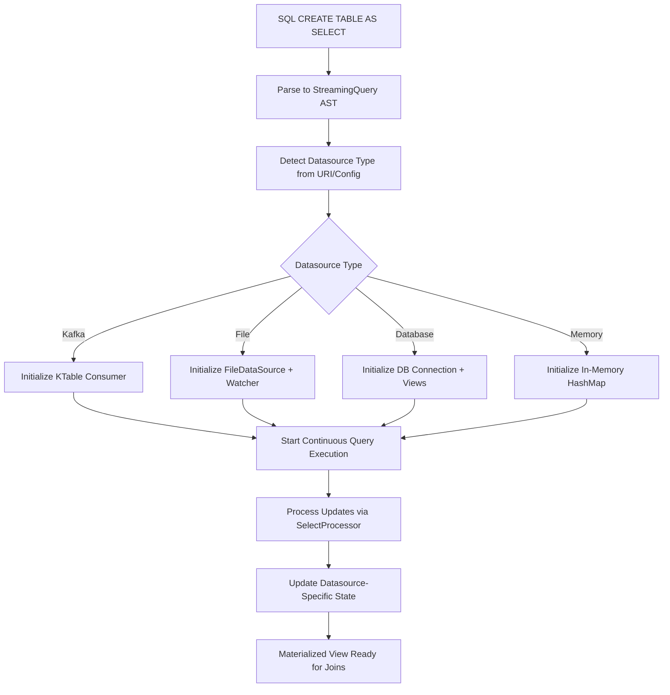

# VeloStream SQL Table Architecture

## Overview

VeloStream implements SQL tables as materialized views with **datasource-agnostic** state management. The system provides a unified SQL interface while delegating state management to pluggable datasource implementations. This architecture enables high-performance stream-table joins, real-time aggregations, and stateful stream processing across heterogeneous data sources including Kafka, files, databases, and more.

## Architecture Components

### 1. Unified SQL Interface

SQL tables in VeloStream are created using `CREATE TABLE AS SELECT` statements that work with **any datasource**:

```sql
-- File-based materialized table
CREATE TABLE user_analytics AS 
SELECT 
    user_id,
    COUNT(*) as order_count,
    SUM(amount) as total_spent,
    AVG(amount) as avg_order_value
FROM file:///data/orders.csv
GROUP BY user_id;

-- Kafka-based materialized table  
CREATE TABLE user_analytics AS
SELECT user_id, COUNT(*) as order_count
FROM kafka://orders-topic
GROUP BY user_id;

-- Database-based materialized table
CREATE TABLE user_analytics AS
SELECT user_id, COUNT(*) as order_count  
FROM postgres://db/orders_table
GROUP BY user_id;
```

### 2. Datasource-Agnostic Processing

The core table processing is completely **datasource-agnostic**:

```rust
// From src/velo/sql/execution/processors/mod.rs
StreamingQuery::CreateTable { as_select, .. } => {
    // For CREATE TABLE AS SELECT, delegate to SelectProcessor for the inner query
    SelectProcessor::process(as_select, record, context)
}
```

**Key Insight**: The system delegates to `SelectProcessor` regardless of datasource type - no KTable-specific logic.

### 3. AST Representation

The SQL parser creates datasource-agnostic AST nodes:

```rust
// From src/velo/sql/ast.rs
CreateTable {
    name: String,                           // Table name (e.g., "user_analytics")
    columns: Option<Vec<ColumnDef>>,        // Optional column definitions
    as_select: Box<StreamingQuery>,         // Continuous SELECT query (datasource-agnostic)
    properties: HashMap<String, String>,    // Datasource-specific properties
}
```

### 4. Pluggable State Management

State management varies by datasource implementation:

#### Kafka Implementation (KTable)
```rust
// From src/velo/kafka/ktable.rs
pub struct KTable<K, V, KS, VS> {
    consumer: Arc<KafkaConsumer<K, V, KS, VS>>,     // Kafka consumer for state updates
    state: Arc<RwLock<HashMap<K, V>>>,              // In-memory materialized state
    topic: String,                                   // Backing Kafka topic
    running: Arc<AtomicBool>,                       // Continuous execution flag
    last_updated: Arc<RwLock<Option<SystemTime>>>,  // State freshness tracking
}
```

#### File Implementation
```rust
// From src/velo/datasource/file/data_source.rs
pub struct FileDataSource {
    config: Option<FileSourceConfig>,               // File path, format, etc.
    metadata: Option<SourceMetadata>,               // Schema and stats
    watcher: Option<FileWatcher>,                   // Real-time file monitoring
}
```

#### Database Implementation (Future)
```rust
// Conceptual - not yet implemented
pub struct DatabaseDataSource {
    connection: Arc<Connection>,                    // Database connection
    materialized_view: String,                     // Database materialized view name
    change_stream: Option<ChangeStream>,           // Real-time change tracking
}
```

### 5. Datasource-Agnostic Flow



## Datasource-Agnostic Stream-Table Joins

### Real-Time Enrichment Patterns

Stream-table joins work the same regardless of the underlying datasource implementation:

#### Kafka-Based Join (KTable Lookup)
```rust
// From examples/ktable_example.rs - Kafka implementation
async fn process_order_stream(
    user_table: KTable<String, UserProfile, JsonSerializer, JsonSerializer>,
) -> Result<(), Box<dyn std::error::Error>> {
    
    let mut stream = order_consumer.stream();
    while let Some(message_result) = stream.next().await {
        match message_result {
            Ok(message) => {
                let order = message.value();
                
                // Stream-table join via KTable lookup
                match user_table.get(&order.user_id) {
                    Some(user_profile) => {
                        // Enrich streaming order with table state
                        let enriched_order = EnrichedOrder {
                            user_name: user_profile.name.clone(),
                            subscription_tier: user_profile.subscription_tier.clone(),
                            discount_eligible: user_profile.subscription_tier == "premium",
                        };
                        producer.send(&enriched_order).await?;
                    }
                    None => log_missing_user(&order.user_id),
                }
            }
        }
    }
    Ok(())
}
```

#### File-Based Join (In-Memory Lookup)
```rust
// File-based table lookup - same SQL interface, different implementation
async fn process_orders_with_file_table(
    file_datasource: &FileDataSource,
) -> Result<(), Box<dyn std::error::Error>> {
    
    // File-based table maintains in-memory materialized state
    // Updated via FileWatcher when CSV/JSON files change
    let reader = file_datasource.create_reader().await?;
    
    while let Some(record) = reader.next_record().await? {
        // Same enrichment logic, different state source
        if let Some(user_profile) = lookup_user_from_file_state(&record.user_id) {
            let enriched_order = EnrichedOrder {
                user_name: user_profile.name,
                subscription_tier: user_profile.subscription_tier,
                discount_eligible: user_profile.subscription_tier == "premium",
            };
            // Process enriched order...
        }
    }
    Ok(())
}
```

### Unified SQL Interface

The SQL interface works identically regardless of datasource implementation:

```sql
-- Works with ANY datasource - Kafka, File, Database, etc.
SELECT 
    o.order_id,
    o.product,
    o.amount,
    u.name as user_name,
    u.email as user_email,
    u.subscription_tier,
    CASE 
        WHEN u.subscription_tier IN ('premium', 'enterprise') 
        THEN true 
        ELSE false 
    END as discount_eligible
FROM orders o                    -- Could be Kafka stream, file stream, etc.
JOIN user_profiles u             -- Could be Kafka table, CSV file, DB table, etc.
ON o.user_id = u.user_id;
```

**Key Benefits**:
- **Same SQL syntax** works across all datasource types
- **Seamless migration** between datasources without query changes
- **Mixed datasource joins** (e.g., Kafka stream + CSV table)

## Key Architectural Benefits

### 1. **Datasource Agnostic Design**
- **Single SQL Interface**: Same `CREATE TABLE AS SELECT` syntax works with any datasource
- **Pluggable Implementations**: Add new datasource types without changing SQL layer
- **Mixed Environments**: Join Kafka streams with CSV files, database tables, etc.
- **Easy Migration**: Switch datasources without rewriting queries

### 2. **Real-Time Materialization** 
- **Continuous Updates**: SQL tables stay current as underlying data changes
- **Real-Time Watching**: File-based tables update via `FileWatcher` for CSV/JSON changes
- **Stream Processing**: Kafka-based tables use KTable for real-time state management
- **No Batch Cycles**: Incremental updates instead of periodic refreshes

### 3. **Flexible State Management**
- **Kafka Tables**: Distributed, fault-tolerant state with topic compaction
- **File Tables**: In-memory state with file system monitoring for changes
- **Database Tables**: Native materialized views with change streams (future)
- **Memory Tables**: Fast in-memory HashMap for testing/development

### 4. **Performance Optimization by Datasource**
- **Kafka**: Partitioned state, consumer group scaling, exactly-once semantics
- **Files**: Memory-mapped I/O, incremental file parsing, efficient watching
- **Database**: Query pushdown, connection pooling, prepared statements
- **Memory**: Direct HashMap lookups, zero serialization overhead

## Datasource-Specific Consistency & Guarantees

### Kafka Tables (Exactly-Once Semantics)
```rust
// KTable configuration ensures exactly-once processing
let config = ConsumerConfig::new(brokers, group_id)
    .auto_offset_reset(OffsetReset::Earliest)        // Rebuild complete state
    .isolation_level(IsolationLevel::ReadCommitted)  // Only committed data
    .auto_commit(false, Duration::from_secs(5));     // Manual commit control
```

**Recovery**: Cold start rebuilds from earliest offset, crash recovery resumes from last commit

### File Tables (Eventual Consistency)
```rust
// File watcher ensures eventual consistency with file system
let watcher = FileWatcher::new(&file_path)
    .poll_interval(Duration::from_millis(100))       // Check file changes every 100ms
    .enable_debouncing(Duration::from_millis(500));  // Debounce rapid changes
```

**Recovery**: Re-read entire file on startup, incremental updates via file watching

### Database Tables (ACID + Change Streams)
```rust
// Database materialized views with change stream monitoring (conceptual)
let db_config = DatabaseConfig::new(connection_string)
    .isolation_level(IsolationLevel::ReadCommitted)  // ACID compliance
    .change_stream(true)                             // Real-time change detection
    .materialized_view("user_analytics_mv");         // Native DB materialized view
```

**Recovery**: Database handles consistency, change streams provide real-time updates

## Production Considerations by Datasource

### Memory Management

#### Kafka Tables
```rust
// KTable provides snapshot and filtering for large tables
pub fn snapshot(&self) -> HashMap<K, V> {
    self.state.read().unwrap().clone()  // Use carefully for large tables
}
// Memory usage: State size limited by Kafka topic compaction
```

#### File Tables  
```rust
// File tables can implement streaming readers to limit memory usage
pub struct FileReader {
    buffered_reader: BufReader<File>,    // Small read buffer
    current_position: u64,               // Track file position
    schema_cache: Option<Schema>,        // Cached schema inference
}
// Memory usage: Configurable buffer size, not entire file in memory
```

#### Database Tables
```rust
// Database tables can use cursors and pagination for large result sets
pub struct DatabaseReader {
    connection: Connection,
    cursor: Option<Cursor>,              // Streaming cursor
    batch_size: usize,                  // Configurable batch size  
}
// Memory usage: Only current batch in memory, database handles the rest
```

### Monitoring & Observability

```rust
// Unified stats interface across all datasource types
pub trait DataSourceStats {
    fn record_count(&self) -> u64;
    fn last_updated(&self) -> Option<SystemTime>;
    fn datasource_type(&self) -> &str;
    fn health_check(&self) -> HealthStatus;
}

// Kafka implementation
impl DataSourceStats for KTable {
    fn datasource_type(&self) -> &str { "kafka" }
    fn health_check(&self) -> HealthStatus { 
        if self.is_running() { HealthStatus::Healthy } else { HealthStatus::Disconnected }
    }
}

// File implementation  
impl DataSourceStats for FileDataSource {
    fn datasource_type(&self) -> &str { "file" }
    fn health_check(&self) -> HealthStatus {
        if self.config.path.exists() { HealthStatus::Healthy } else { HealthStatus::FileNotFound }
    }
}
```

## Integration with Financial Precision

VeloStream' financial precision system works across **all datasource types**:

```rust
// ScaledInteger maintains exact precision regardless of storage
let user_balance = FieldValue::ScaledInteger(1234567, 2);  // $12,345.67

// Kafka table storage
kafka_table.insert("user-001".to_string(), user_balance);

// File-based storage (serializes as "12345.67" in CSV/JSON)
file_writer.write_record(&record_with_balance);

// Database storage (stored as DECIMAL(15,2))
db_table.insert_balance(user_id, user_balance);

// All use same 42x faster arithmetic operations in aggregations
let total = accumulator.add_scaled_integer(1234567, 2, 987654, 2);
```

## Example: Multi-Datasource Trading Analytics

```sql
-- User positions from Kafka (real-time trading data)
CREATE TABLE user_positions AS
SELECT 
    user_id,
    symbol,
    SUM(quantity) as position_size,
    SUM(quantity * price) as position_value
FROM kafka://trades-topic
GROUP BY user_id, symbol;

-- Reference data from CSV file (updated daily)
CREATE TABLE symbol_metadata AS
SELECT 
    symbol,
    sector,
    market_cap,
    risk_rating
FROM file:///data/symbol_reference.csv;

-- User profiles from database (CRM system)
CREATE TABLE user_profiles AS
SELECT
    user_id,
    account_type,
    risk_tolerance,
    max_position_size
FROM postgres://crm_db/user_accounts;

-- Real-time P&L calculation with mixed datasource joins
SELECT 
    t.trade_id,
    t.user_id,
    t.symbol,
    t.quantity,
    t.price,
    p.position_size,                    -- From Kafka table
    s.sector,                           -- From CSV file table  
    s.risk_rating,                      -- From CSV file table
    u.risk_tolerance,                   -- From database table
    (t.price * t.quantity) as trade_value,
    p.position_value as current_position_value
FROM kafka://live-trades-stream t       -- Kafka stream
JOIN user_positions p ON t.user_id = p.user_id AND t.symbol = p.symbol
JOIN symbol_metadata s ON t.symbol = s.symbol  
JOIN user_profiles u ON t.user_id = u.user_id
WHERE u.risk_tolerance >= s.risk_rating;
```

## Summary

This **datasource-agnostic architecture** provides:
- **Unified SQL interface** across Kafka, files, databases, and memory
- **Pluggable state management** optimized for each datasource type  
- **Mixed datasource joins** enabling hybrid architectures
- **High-performance processing** with exact financial precision
- **Familiar SQL semantics** regardless of underlying infrastructure

The system abstracts away datasource complexity while providing specialized optimizations for each storage type, enabling real-time analytics across heterogeneous environments.