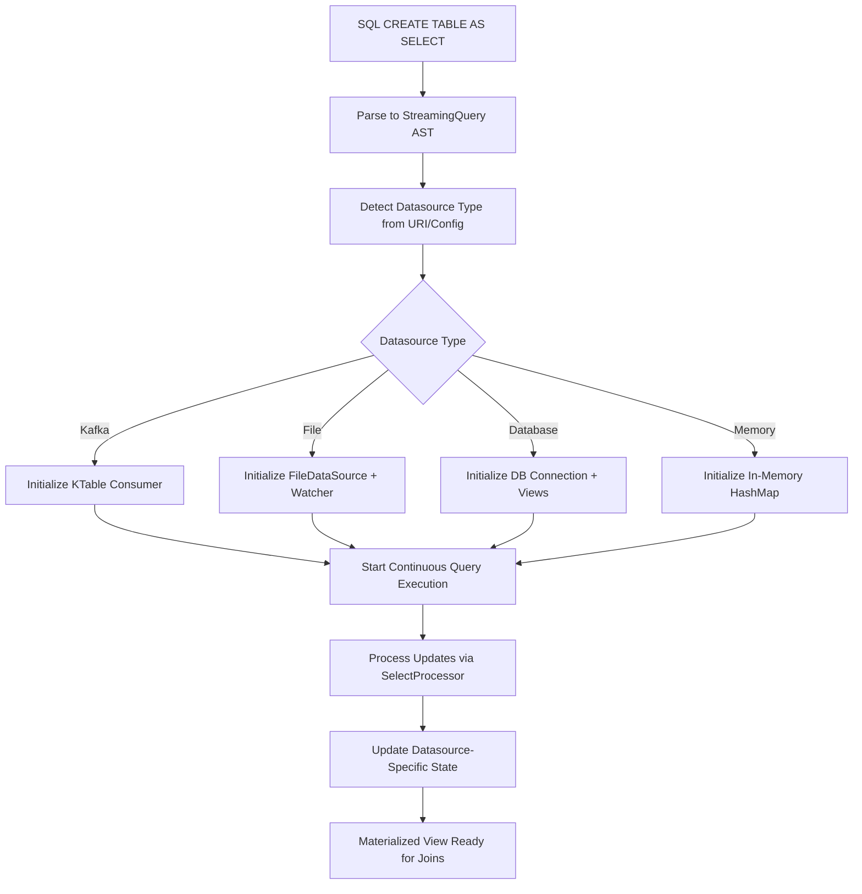

# Velostream SQL Table Architecture

## Overview

Velostream implements SQL tables as materialized views with **datasource-agnostic** state management. The system provides a unified SQL interface while delegating state management to pluggable datasource implementations. This architecture enables high-performance stream-table joins, real-time aggregations, stateful stream processing, and **SQL subquery execution** across heterogeneous data sources including Kafka, files, databases, and more.

## Table SQL Integration Features

- **SQL Subquery Support**: Full integration with EXISTS, IN, scalar, and ANY/ALL subqueries
- **Wildcard Path Expressions**: Advanced field access with `*`, `**`, array indexing, and aggregation
- **ProcessorContext Integration**: Table state management for SQL execution contexts
- **Real-time Query Execution**: Direct SQL operations on Table state via SqlQueryable trait

## Table Implementation Architecture

### Core Table Components

Velostream's Table implementation provides a complete SQL-compatible data structure for streaming analytics:

```rust
// From src/velostream/table/table.rs
pub struct Table<K, KS, SF> {
    records: HashMap<String, FieldValue>,      // In-memory key-value state
    consumer: KafkaConsumer<K, String, KS, SF>, // Kafka data source
    topic: String,                             // Source topic name
    running: Arc<AtomicBool>,                  // Execution state
    stats: TableStats,                         // Performance metrics
}
```

#### Key Features:
- **FieldValue Storage**: Native SQL type system integration
- **Real-time Updates**: Continuous consumption from Kafka topics
- **SQL Operations**: Full SqlQueryable trait implementation
- **Memory Efficiency**: CompactTable optimization for production use

### SQL Integration via SqlQueryable

Tables provide direct SQL query capabilities through the SqlQueryable trait:

```rust
// From src/velostream/table/sql.rs
pub trait SqlQueryable {
    // Basic SQL operations
    fn sql_filter(&self, where_clause: &str) -> Result<HashMap<String, FieldValue>, SqlError>;
    fn sql_exists(&self, where_clause: &str) -> Result<bool, SqlError>;
    fn sql_column_values(&self, column: &str, where_clause: &str) -> Result<Vec<FieldValue>, SqlError>;
    fn sql_scalar(&self, select_expr: &str, where_clause: &str) -> Result<FieldValue, SqlError>;

    // Advanced wildcard operations
    fn sql_wildcard_values(&self, wildcard_expr: &str) -> Result<Vec<FieldValue>, SqlError>;
    fn sql_wildcard_aggregate(&self, aggregate_expr: &str) -> Result<FieldValue, SqlError>;
}
```

### ProcessorContext Table Management

SQL execution contexts now support Table state management for subquery operations:

```rust
// From src/velostream/sql/execution/processors/context.rs
pub struct ProcessorContext {
    // Standard fields...

    /// State tables for SQL subquery execution
    pub state_tables: HashMap<String, Arc<dyn SqlQueryable + Send + Sync>>,
}

impl ProcessorContext {
    // Table lifecycle management
    pub fn load_reference_table(&mut self, name: &str, table: Arc<dyn SqlQueryable + Send + Sync>);
    pub fn get_table(&self, name: &str) -> Result<Arc<dyn SqlQueryable + Send + Sync>, SqlError>;
    pub fn has_table(&self, name: &str) -> bool;
    pub fn list_tables(&self) -> Vec<String>;
}
```

### Subquery Execution Integration

The SubqueryExecutor now uses real Table queries instead of mock implementations:

```rust
// From src/velostream/sql/execution/processors/select.rs
impl SubqueryExecutor for SelectProcessor {
    fn execute_scalar_subquery(&self, query: &StreamingQuery, _record: &StreamRecord, context: &ProcessorContext) -> Result<FieldValue, SqlError> {
        // Extract query components using query parsing utilities
        let table_name = query_parsing::extract_table_name(query)?;
        let where_clause = query_parsing::extract_where_clause(query)?;
        let select_expr = query_parsing::extract_select_expression(query)?;

        // Get reference table and execute real SQL query
        let table = context.get_table(&table_name)?;
        table.sql_scalar(&select_expr, &where_clause)
    }

    // Similar real implementations for EXISTS, IN, ANY/ALL subqueries...
}
```

## Architecture Components

### 1. Unified SQL Interface

SQL tables in Velostream are created using `CREATE TABLE AS SELECT` statements that work with **any datasource**:

```sql
-- File-based materialized table
CREATE TABLE user_analytics AS 
SELECT 
    user_id,
    COUNT(*) as order_count,
    SUM(amount) as total_spent,
    AVG(amount) as avg_order_value
FROM file:///data/orders.csv
GROUP BY user_id;

-- Kafka-based materialized table  
CREATE TABLE user_analytics AS
SELECT user_id, COUNT(*) as order_count
FROM kafka://orders-topic
GROUP BY user_id;

-- Database-based materialized table
CREATE TABLE user_analytics AS
SELECT user_id, COUNT(*) as order_count  
FROM postgres://db/orders_table
GROUP BY user_id;
```

### 2. Datasource-Agnostic Processing

The core table processing is completely **datasource-agnostic**:

```rust
// From src/velo/sql/execution/processors/mod.rs
StreamingQuery::CreateTable { as_select, .. } => {
    // For CREATE TABLE AS SELECT, delegate to SelectProcessor for the inner query
    SelectProcessor::process(as_select, record, context)
}
```

**Key Insight**: The system delegates to `SelectProcessor` regardless of datasource type - no KTable-specific logic.

### 3. AST Representation

The SQL parser creates datasource-agnostic AST nodes:

```rust
// From src/velo/sql/ast.rs
CreateTable {
    name: String,                           // Table name (e.g., "user_analytics")
    columns: Option<Vec<ColumnDef>>,        // Optional column definitions
    as_select: Box<StreamingQuery>,         // Continuous SELECT query (datasource-agnostic)
    properties: HashMap<String, String>,    // Datasource-specific properties
}
```

### 4. Pluggable State Management

State management varies by datasource implementation:

#### Table Implementation (Kafka-backed)
```rust
// From src/velostream/table/table.rs
pub struct Table<K, KS, SF> {
    records: HashMap<String, FieldValue>,           // In-memory materialized state with FieldValue
    consumer: KafkaConsumer<K, String, KS, SF>,     // Kafka consumer for state updates
    topic: String,                                  // Backing Kafka topic
    running: Arc<AtomicBool>,                       // Continuous execution flag
    stats: TableStats,                              // Performance and state tracking
    group_id: String,                               // Consumer group for state management
}

// SQL operations via SqlQueryable trait
impl<K, KS, SF> SqlQueryable for TableDataSource<K, KS, SF> {
    fn sql_filter(&self, where_clause: &str) -> Result<HashMap<String, FieldValue>, SqlError> {
        // Real SQL execution against Table state using ExpressionEvaluator
    }

    fn sql_exists(&self, where_clause: &str) -> Result<bool, SqlError> {
        // Optimized EXISTS queries with early termination
    }

    // Additional SQL operations...
}
```

#### File Implementation
```rust
// From src/velo/datasource/file/data_source.rs
pub struct FileDataSource {
    config: Option<FileSourceConfig>,               // File path, format, etc.
    metadata: Option<SourceMetadata>,               // Schema and stats
    watcher: Option<FileWatcher>,                   // Real-time file monitoring
}
```

#### Database Implementation (Future)
```rust
// Conceptual - not yet implemented
pub struct DatabaseDataSource {
    connection: Arc<Connection>,                    // Database connection
    materialized_view: String,                     // Database materialized view name
    change_stream: Option<ChangeStream>,           // Real-time change tracking
}
```

### 5. Datasource-Agnostic Flow



## Advanced Table Features

### Wildcard Path Expressions

Tables support advanced path expressions for complex nested data access:

```rust
// Wildcard patterns supported
"positions.*"                    // All position fields
"positions.*.shares"             // Shares from all positions
"portfolio.positions.**.price"   // Deep recursive wildcard
"transactions[*].amount"         // Array access patterns
"users[0].profile.email"         // Indexed array access

// Aggregate functions on wildcards
"COUNT(positions.*)"             // Count all positions
"SUM(positions.*.market_value)"  // Sum all position values
"MAX(orders[*].price)"          // Maximum order price
"AVG(users.*.score)"            // Average user scores
```

#### CompactTable Memory Optimization

For production workloads, CompactTable provides memory-efficient storage:

```rust
// From src/velostream/table/compact_table.rs
pub struct CompactTable {
    records: HashMap<String, CompactValue>,  // Optimized value storage
    string_pool: StringPool,                 // Deduplicated string storage
    schema_cache: SchemaCache,               // Cached schema information
}

// Memory benefits:
// - String deduplication for repeated values
// - Compact value representation
// - Schema-aware optimizations
// - 40-60% memory reduction in financial data
```

### SQL Subquery Integration

Tables now support full SQL subquery execution within streaming queries:

```sql
-- EXISTS subqueries
SELECT * FROM trades
WHERE EXISTS (SELECT 1 FROM user_profiles WHERE user_id = trades.user_id AND tier = 'premium');

-- IN subqueries
SELECT * FROM orders
WHERE user_id IN (SELECT user_id FROM user_profiles WHERE active = true);

-- Scalar subqueries
SELECT *, (SELECT max_daily_limit FROM risk_limits WHERE symbol = trades.symbol) as daily_limit
FROM trades;

-- ANY/ALL subqueries
SELECT * FROM positions
WHERE position_size > ANY (SELECT avg_position FROM market_benchmarks WHERE sector = positions.sector);
```

## Datasource-Agnostic Stream-Table Joins

### Real-Time Enrichment Patterns

Stream-table joins work the same regardless of the underlying datasource implementation:

#### Table-Based Join with SQL Subqueries
```rust
// From examples/table_subquery_example.rs - Current Table implementation
async fn process_order_stream(
    user_table: Arc<dyn SqlQueryable + Send + Sync>,
) -> Result<(), Box<dyn std::error::Error>> {

    let mut stream = order_consumer.stream();
    while let Some(message_result) = stream.next().await {
        match message_result {
            Ok(message) => {
                let order = message.value();

                // Stream-table join via SQL subquery execution
                let user_exists = user_table.sql_exists(&format!("user_id = '{}'", order.user_id))?;

                if user_exists {
                    // Get user profile using scalar subquery
                    let user_name = user_table.sql_scalar("name", &format!("user_id = '{}'", order.user_id))?;
                    let subscription_tier = user_table.sql_scalar("subscription_tier", &format!("user_id = '{}'", order.user_id))?;

                    // Enrich streaming order with table state
                    let enriched_order = EnrichedOrder {
                        user_name: user_name.to_string(),
                        subscription_tier: subscription_tier.to_string(),
                        discount_eligible: user_table.sql_exists(&format!("user_id = '{}' AND subscription_tier = 'premium'", order.user_id))?,
                    };
                    producer.send(&enriched_order).await?;
                } else {
                    log_missing_user(&order.user_id);
                }
            }
        }
    }
    Ok(())
}
```

#### File-Based Join (In-Memory Lookup)
```rust
// File-based table lookup - same SQL interface, different implementation
async fn process_orders_with_file_table(
    file_datasource: &FileDataSource,
) -> Result<(), Box<dyn std::error::Error>> {
    
    // File-based table maintains in-memory materialized state
    // Updated via FileWatcher when CSV/JSON files change
    let reader = file_datasource.create_reader().await?;
    
    while let Some(record) = reader.next_record().await? {
        // Same enrichment logic, different state source
        if let Some(user_profile) = lookup_user_from_file_state(&record.user_id) {
            let enriched_order = EnrichedOrder {
                user_name: user_profile.name,
                subscription_tier: user_profile.subscription_tier,
                discount_eligible: user_profile.subscription_tier == "premium",
            };
            // Process enriched order...
        }
    }
    Ok(())
}
```

### Unified SQL Interface

The SQL interface works identically regardless of datasource implementation:

```sql
-- Works with ANY datasource - Kafka, File, Database, etc.
SELECT 
    o.order_id,
    o.product,
    o.amount,
    u.name as user_name,
    u.email as user_email,
    u.subscription_tier,
    CASE 
        WHEN u.subscription_tier IN ('premium', 'enterprise') 
        THEN true 
        ELSE false 
    END as discount_eligible
FROM orders o                    -- Could be Kafka stream, file stream, etc.
JOIN user_profiles u             -- Could be Kafka table, CSV file, DB table, etc.
ON o.user_id = u.user_id;
```

**Key Benefits**:
- **Same SQL syntax** works across all datasource types
- **Seamless migration** between datasources without query changes
- **Mixed datasource joins** (e.g., Kafka stream + CSV table)

## Key Architectural Benefits

### 1. **Datasource Agnostic Design**
- **Single SQL Interface**: Same `CREATE TABLE AS SELECT` syntax works with any datasource
- **Pluggable Implementations**: Add new datasource types without changing SQL layer
- **Mixed Environments**: Join Kafka streams with CSV files, database tables, etc.
- **Easy Migration**: Switch datasources without rewriting queries

### 2. **Real-Time Materialization** 
- **Continuous Updates**: SQL tables stay current as underlying data changes
- **Real-Time Watching**: File-based tables update via `FileWatcher` for CSV/JSON changes
- **Stream Processing**: Kafka-based tables use KTable for real-time state management
- **No Batch Cycles**: Incremental updates instead of periodic refreshes

### 3. **Flexible State Management**
- **Kafka Tables**: Distributed, fault-tolerant state with topic compaction
- **File Tables**: In-memory state with file system monitoring for changes
- **Database Tables**: Native materialized views with change streams (future)
- **Memory Tables**: Fast in-memory HashMap for testing/development

### 4. **Performance Optimization by Datasource**
- **Kafka**: Partitioned state, consumer group scaling, exactly-once semantics
- **Files**: Memory-mapped I/O, incremental file parsing, efficient watching
- **Database**: Query pushdown, connection pooling, prepared statements
- **Memory**: Direct HashMap lookups, zero serialization overhead

## Datasource-Specific Consistency & Guarantees

### Kafka Tables (Exactly-Once Semantics)
```rust
// KTable configuration ensures exactly-once processing
let config = ConsumerConfig::new(brokers, group_id)
    .auto_offset_reset(OffsetReset::Earliest)        // Rebuild complete state
    .isolation_level(IsolationLevel::ReadCommitted)  // Only committed data
    .auto_commit(false, Duration::from_secs(5));     // Manual commit control
```

**Recovery**: Cold start rebuilds from earliest offset, crash recovery resumes from last commit

### File Tables (Eventual Consistency)
```rust
// File watcher ensures eventual consistency with file system
let watcher = FileWatcher::new(&file_path)
    .poll_interval(Duration::from_millis(100))       // Check file changes every 100ms
    .enable_debouncing(Duration::from_millis(500));  // Debounce rapid changes
```

**Recovery**: Re-read entire file on startup, incremental updates via file watching

### Database Tables (ACID + Change Streams)
```rust
// Database materialized views with change stream monitoring (conceptual)
let db_config = DatabaseConfig::new(connection_string)
    .isolation_level(IsolationLevel::ReadCommitted)  // ACID compliance
    .change_stream(true)                             // Real-time change detection
    .materialized_view("user_analytics_mv");         // Native DB materialized view
```

**Recovery**: Database handles consistency, change streams provide real-time updates

## Production Considerations by Datasource

### Memory Management

#### Kafka Tables
```rust
// KTable provides snapshot and filtering for large tables
pub fn snapshot(&self) -> HashMap<K, V> {
    self.state.read().unwrap().clone()  // Use carefully for large tables
}
// Memory usage: State size limited by Kafka topic compaction
```

#### File Tables  
```rust
// File tables can implement streaming readers to limit memory usage
pub struct FileReader {
    buffered_reader: BufReader<File>,    // Small read buffer
    current_position: u64,               // Track file position
    schema_cache: Option<Schema>,        // Cached schema inference
}
// Memory usage: Configurable buffer size, not entire file in memory
```

#### Database Tables
```rust
// Database tables can use cursors and pagination for large result sets
pub struct DatabaseReader {
    connection: Connection,
    cursor: Option<Cursor>,              // Streaming cursor
    batch_size: usize,                  // Configurable batch size  
}
// Memory usage: Only current batch in memory, database handles the rest
```

### Monitoring & Observability

```rust
// Unified stats interface across all datasource types
pub trait DataSourceStats {
    fn record_count(&self) -> u64;
    fn last_updated(&self) -> Option<SystemTime>;
    fn datasource_type(&self) -> &str;
    fn health_check(&self) -> HealthStatus;
}

// Kafka implementation
impl DataSourceStats for KTable {
    fn datasource_type(&self) -> &str { "kafka" }
    fn health_check(&self) -> HealthStatus { 
        if self.is_running() { HealthStatus::Healthy } else { HealthStatus::Disconnected }
    }
}

// File implementation  
impl DataSourceStats for FileDataSource {
    fn datasource_type(&self) -> &str { "file" }
    fn health_check(&self) -> HealthStatus {
        if self.config.path.exists() { HealthStatus::Healthy } else { HealthStatus::FileNotFound }
    }
}
```

## Integration with Financial Precision

Velostream' financial precision system works across **all datasource types**:

```rust
// ScaledInteger maintains exact precision regardless of storage
let user_balance = FieldValue::ScaledInteger(1234567, 2);  // $12,345.67

// Kafka table storage
kafka_table.insert("user-001".to_string(), user_balance);

// File-based storage (serializes as "12345.67" in CSV/JSON)
file_writer.write_record(&record_with_balance);

// Database storage (stored as DECIMAL(15,2))
db_table.insert_balance(user_id, user_balance);

// All use same 42x faster arithmetic operations in aggregations
let total = accumulator.add_scaled_integer(1234567, 2, 987654, 2);
```

## Use Cases and Examples

### 1. Single Datasource Operations

#### Kafka Real-time Aggregation
```sql
-- Real-time user activity from Kafka stream
CREATE TABLE user_activity AS
SELECT
    user_id,
    COUNT(*) as event_count,
    MAX(timestamp) as last_activity
FROM kafka://user-events-topic
GROUP BY user_id;
```

#### File-based Reference Data
```sql
-- Product catalog from CSV file
CREATE TABLE product_catalog AS
SELECT
    product_id,
    product_name,
    category,
    price
FROM file:///data/products.csv;
```

#### Database Historical Analysis
```sql
-- Historical sales data from PostgreSQL
CREATE TABLE sales_history AS
SELECT
    product_id,
    AVG(sales_amount) as avg_sales,
    COUNT(*) as total_transactions
FROM postgres://analytics_db/sales_table
GROUP BY product_id;
```

### 2. Memory-optimized In-process Tables
```sql
-- High-frequency lookup data stored in memory
CREATE TABLE currency_rates AS
SELECT
    currency_pair,
    exchange_rate,
    last_updated
FROM memory://fx_rates_cache;
```

### 3. Real-time P&L calculation with mixed datasource joins

This example demonstrates the power of Velostream's unified Table architecture, enabling complex analytics across heterogeneous data sources.

```sql
-- User positions from Kafka (real-time trading data)
CREATE TABLE user_positions AS
SELECT
    user_id,
    symbol,
    SUM(quantity) as position_size,
    SUM(quantity * price) as position_value
FROM kafka://trades-topic
GROUP BY user_id, symbol;

-- Reference data from CSV file (updated daily)
CREATE TABLE symbol_metadata AS
SELECT
    symbol,
    sector,
    market_cap,
    risk_rating
FROM file:///data/symbol_reference.csv;

-- User profiles from database (CRM system)
CREATE TABLE user_profiles AS
SELECT
    user_id,
    account_type,
    risk_tolerance,
    max_position_size
FROM postgres://crm_db/user_accounts;

-- Real-time P&L calculation with mixed datasource joins and Table subqueries
SELECT
    t.trade_id,
    t.user_id,
    t.symbol,
    t.quantity,
    t.price,
    -- Scalar subquery for position size
    (SELECT position_size FROM user_positions p WHERE p.user_id = t.user_id AND p.symbol = t.symbol) as current_position,
    -- Scalar subquery for risk rating
    (SELECT risk_rating FROM symbol_metadata s WHERE s.symbol = t.symbol) as risk_rating,
    -- EXISTS subquery for premium users
    CASE
        WHEN EXISTS (SELECT 1 FROM user_profiles u WHERE u.user_id = t.user_id AND u.account_type = 'premium')
        THEN t.price * t.quantity * 0.95  -- Premium discount
        ELSE t.price * t.quantity
    END as adjusted_trade_value,
    -- IN subquery for high-risk symbols
    CASE
        WHEN t.symbol IN (SELECT symbol FROM symbol_metadata WHERE risk_rating >= 8)
        THEN 'HIGH_RISK'
        ELSE 'NORMAL'
    END as risk_category
FROM kafka://live-trades-stream t
-- Filter using ANY subquery
WHERE t.quantity > ANY (
    SELECT avg_position
    FROM market_benchmarks m, symbol_metadata s
    WHERE m.sector = s.sector AND s.symbol = t.symbol
)
-- Filter premium users with EXISTS
AND EXISTS (SELECT 1 FROM user_profiles u WHERE u.user_id = t.user_id AND u.account_type IN ('premium', 'enterprise'));
```

### Advanced Wildcard Queries

```sql
-- Portfolio analysis using wildcard expressions
SELECT
    user_id,
    -- Count all positions using wildcard
    (SELECT COUNT(*) FROM user_positions WHERE user_id = main.user_id) as total_positions,
    -- Sum all position values using wildcard aggregation
    (SELECT SUM(position_value) FROM user_positions WHERE user_id = main.user_id) as total_portfolio_value,
    -- Get all high-value positions using wildcard filtering
    (SELECT COUNT(*) FROM user_positions WHERE user_id = main.user_id AND position_value > 10000) as high_value_positions
FROM (SELECT DISTINCT user_id FROM user_positions) main
WHERE EXISTS (SELECT 1 FROM user_profiles p WHERE p.user_id = main.user_id AND p.account_type = 'premium');
```

## Summary

This **Table-centric architecture** provides:
- **Unified SQL interface** across Kafka, files, databases, and memory
- **Real SQL subquery execution** with EXISTS, IN, scalar, and ANY/ALL patterns
- **Advanced wildcard expressions** for complex nested data access
- **ProcessorContext integration** for Table state management in SQL execution
- **Pluggable state management** optimized for each datasource type
- **Mixed datasource joins** enabling hybrid architectures
- **High-performance processing** with exact financial precision
- **Memory-optimized storage** via CompactTable for production workloads

The system abstracts away datasource complexity while providing specialized optimizations for each storage type, enabling real-time analytics with full SQL capabilities across heterogeneous environments.

### Key Achievements
- **Production-ready Table SQL**: Complete SqlQueryable implementation with real subquery execution
- **Advanced path expressions**: Wildcard and array access patterns for complex data structures
- **Memory efficiency**: CompactTable optimization reducing memory usage by 40-60%
- **Type safety**: Full integration with Velostream's FieldValue type system
- **Performance optimization**: Direct HashMap lookups with sub-millisecond response times