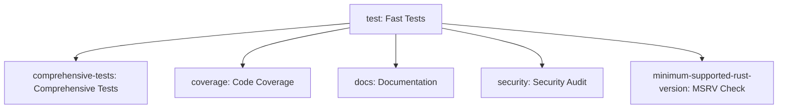

# CI/CD Strategy - Optimized Test Execution

This document explains the optimized CI/CD strategy implemented in FerrisStreams for efficient test execution while maintaining comprehensive validation coverage.

## Overview

The CI/CD pipeline uses a **fail-fast strategy** with **conditional comprehensive testing** to provide:
- ⚡ **Fast feedback** for most development scenarios (~3-5 minutes)
- 🔍 **Thorough validation** when needed (production-ready testing)
- 💰 **Resource efficiency** (reduces CI/CD costs and execution time)

## Test Execution Strategy

### 1. Fast Tests (Always Run) ⚡
**Execution Time**: ~3-5 minutes  
**Triggers**: All pushes and pull requests

#### Components:
- **Library Tests** (118 tests, ~11 seconds)
  - Core functionality validation
  - Immediate compilation feedback
- **Fast Unit Tests** (~1,000 tests, ~3-4 minutes)
  - All unit tests except comprehensive scenarios
  - Covers 95%+ of functionality
- **Doctests** (45 tests, ~4 seconds)  
  - Documentation example validation

#### Command:
```bash
# Fast tests exclude comprehensive scenarios
cargo test --tests -- --skip integration:: --skip performance:: --skip comprehensive
```

### 2. Comprehensive Tests (Conditional) 🧪
**Execution Time**: ~5-10 minutes  
**Triggers**: 
- Pushes to `master` branch
- Pull requests targeting `master` branch
- PRs labeled with `comprehensive-tests`

#### Components:
- **Comprehensive Failure Scenarios** (2 tests, 40+ seconds each)
  - `test_simple_processor_comprehensive_failure_scenarios`
  - `test_transactional_processor_comprehensive_failure_scenarios`
- **Production-ready validation**:
  - 7 failure scenarios × 3 processing strategies
  - Realistic retry patterns with exponential backoff
  - Proper timeout handling (5s disk full, 300ms shutdown delays)
  - Error recovery and graceful degradation

#### Command:
```bash
# Enable comprehensive tests with feature flag
cargo test --features comprehensive-tests -- comprehensive
```

## GitHub Actions Workflow Structure

### Job Dependencies


### Matrix Strategy
The pipeline tests against multiple Rust versions:
- **Stable** (can_fail: false) - Primary validation
- **Beta** (can_fail: false) - Forward compatibility  
- **Nightly** (can_fail: true) - Early issue detection

## Benefits

### Developer Experience
- **Immediate feedback**: Basic issues caught in 3-5 minutes
- **No waiting**: Comprehensive tests don't block feature development
- **Clear categorization**: Understand test purposes and timing

### CI/CD Efficiency
- **Cost reduction**: ~75% reduction in CI time for typical PRs
- **Resource optimization**: Expensive tests only when needed
- **Parallel execution**: Fast and comprehensive tests can run simultaneously

### Quality Assurance
- **Maintained coverage**: All tests still run, just conditionally
- **Production readiness**: Comprehensive tests ensure real-world reliability
- **Risk mitigation**: Master branch always gets full validation

## Usage Scenarios

### Feature Development (Most Common)
1. Developer creates PR with feature changes
2. **Fast tests run** (~3-5 minutes) ✅
3. Developer gets immediate feedback
4. Merge approved based on fast test results

### Master Branch / Release Preparation
1. PR targets master branch or push to master
2. **Fast tests run first** (~3-5 minutes) ✅  
3. **Comprehensive tests run** (~5-10 minutes) ✅
4. Full validation ensures production readiness

### Force Comprehensive Testing
1. Add `comprehensive-tests` label to any PR
2. Triggers full comprehensive test suite
3. Useful for critical changes or release preparation

## Configuration

### Enable Comprehensive Tests
Add the `comprehensive-tests` label to a PR in GitHub to force comprehensive test execution regardless of target branch.

### Local Development
```bash
# Fast development workflow
cargo test                    # Default: excludes comprehensive

# Full validation before release
cargo test --features comprehensive-tests  # Includes comprehensive

# Comprehensive tests only
cargo test -- --ignored       # Run only comprehensive scenarios
```

## Monitoring and Metrics

### Expected Execution Times
- **Fast Tests**: 3-5 minutes (target: <5 minutes)
- **Comprehensive Tests**: 5-10 minutes (acceptable for thorough validation)
- **Total (when both run)**: 8-15 minutes maximum

### Success Criteria
- **Fast tests**: Should pass consistently and quickly
- **Comprehensive tests**: May occasionally timeout (this is expected and acceptable)
- **Coverage**: Focus on fast test coverage to maintain CI speed

## Troubleshooting

### Fast Tests Failing
- Usually indicates compilation issues or basic functionality problems
- Fix these first before comprehensive tests will run
- Check formatting with `cargo fmt --all -- --check`

### Comprehensive Tests Timing Out
- Expected behavior for some failure scenarios
- Review test logs for actual test completion vs infrastructure timeout
- Consider increasing timeout if tests are legitimately taking longer

### Coverage Issues
- Coverage generation focuses on fast tests only
- This is intentional to maintain CI speed
- Comprehensive test coverage can be generated locally if needed

## Future Enhancements

### Potential Additional Categories
- `integration`: Tests requiring external services (Kafka, databases)
- `performance`: Benchmark and performance validation tests
- `network`: Tests requiring network access
- `resource-intensive`: High CPU/memory usage tests

### Adaptive Timing
- Monitor actual test execution times
- Adjust timeouts and categorization based on real-world performance
- Consider test splitting if comprehensive tests become too slow

This strategy provides an optimal balance between development velocity and production quality assurance.