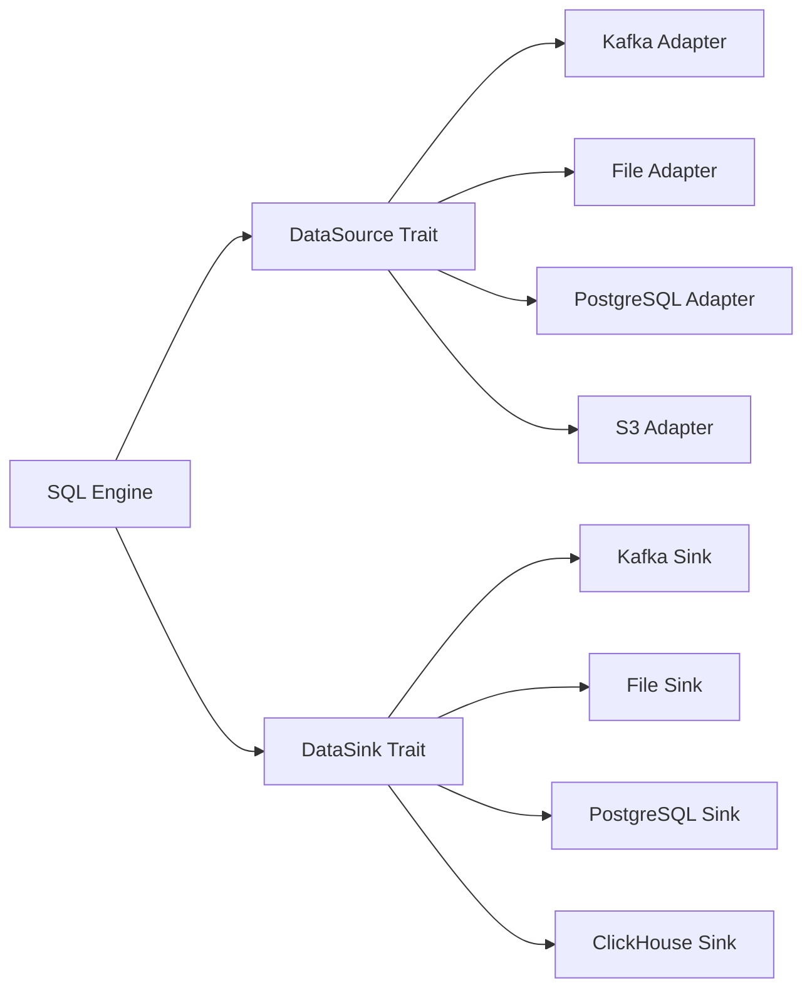

# Developer Guide: Implementing New Data Sources

This guide shows how to implement new data source adapters using the FerrisStreams pluggable architecture.

## 📋 Overview

The pluggable data sources architecture uses four core traits:
- **`DataSource`** - Input sources (files, databases, APIs)
- **`DataSink`** - Output destinations (databases, files, APIs)  
- **`DataReader`** - Reading records from sources
- **`DataWriter`** - Writing records to sinks

## 🏗️ Architecture



## 🚀 Quick Start: File Data Source

Let's implement a CSV file data source step by step:

### Step 1: Define the Data Source

```rust
use crate::ferris::sql::datasource::{
    DataSource, DataReader, SourceConfig, SourceMetadata
};
use crate::ferris::sql::schema::Schema;
use crate::ferris::sql::execution::types::StreamRecord;
use async_trait::async_trait;
use std::error::Error;

pub struct CsvFileDataSource {
    file_path: String,
    delimiter: char,
    has_header: bool,
    schema: Option<Schema>,
}

impl CsvFileDataSource {
    pub fn new(file_path: String) -> Self {
        Self {
            file_path,
            delimiter: ',',
            has_header: true,
            schema: None,
        }
    }
    
    pub fn with_delimiter(mut self, delimiter: char) -> Self {
        self.delimiter = delimiter;
        self
    }
    
    pub fn with_header(mut self, has_header: bool) -> Self {
        self.has_header = has_header;
        self
    }
}
```

### Step 2: Implement DataSource Trait

```rust
#[async_trait]
impl DataSource for CsvFileDataSource {
    async fn initialize(
        &mut self,
        config: SourceConfig,
    ) -> Result<(), Box<dyn Error + Send + Sync>> {
        match config {
            SourceConfig::File { path, format, properties } => {
                self.file_path = path;
                
                // Parse delimiter from properties
                if let Some(delimiter) = properties.get("delimiter") {
                    self.delimiter = delimiter.chars().next().unwrap_or(',');
                }
                
                // Parse header setting
                if let Some(header) = properties.get("header") {
                    self.has_header = header.parse().unwrap_or(true);
                }
                
                Ok(())
            }
            _ => Err("Expected File configuration".into()),
        }
    }

    async fn fetch_schema(&self) -> Result<Schema, Box<dyn Error + Send + Sync>> {
        // Read first few rows to infer schema
        let file = std::fs::File::open(&self.file_path)?;
        let mut reader = csv::ReaderBuilder::new()
            .delimiter(self.delimiter as u8)
            .has_headers(self.has_header)
            .from_reader(file);
            
        // Infer schema from first record
        let mut fields = Vec::new();
        if let Some(headers) = reader.headers().ok() {
            for header in headers {
                fields.push(FieldDefinition::optional(
                    header.to_string(),
                    DataType::String, // Simple: treat all as strings initially
                ));
            }
        }
        
        Ok(Schema::new(fields))
    }

    async fn create_reader(&self) -> Result<Box<dyn DataReader>, Box<dyn Error + Send + Sync>> {
        let reader = CsvFileDataReader::new(
            &self.file_path,
            self.delimiter,
            self.has_header,
        )?;
        Ok(Box::new(reader))
    }

    fn supports_streaming(&self) -> bool {
        true // CSV files can be read as streams
    }

    fn supports_batch(&self) -> bool {
        true // CSV files are naturally batch-oriented
    }

    fn metadata(&self) -> SourceMetadata {
        SourceMetadata {
            source_type: "csv_file".to_string(),
            version: "1.0.0".to_string(),
            supports_streaming: true,
            supports_batch: true,
            supports_schema_evolution: false, // CSV schema is fixed
            capabilities: vec![
                "local_files".to_string(),
                "schema_inference".to_string(),
                "custom_delimiters".to_string(),
            ],
        }
    }
}
```

### Step 3: Implement DataReader

```rust
use csv::Reader;
use std::fs::File;

pub struct CsvFileDataReader {
    reader: Reader<File>,
    headers: Vec<String>,
    row_number: u64,
}

impl CsvFileDataReader {
    pub fn new(
        file_path: &str,
        delimiter: char,
        has_header: bool,
    ) -> Result<Self, Box<dyn Error + Send + Sync>> {
        let file = File::open(file_path)?;
        let mut reader = csv::ReaderBuilder::new()
            .delimiter(delimiter as u8)
            .has_headers(has_header)
            .from_reader(file);
            
        // Get headers
        let headers = if has_header {
            reader.headers()?.iter().map(|h| h.to_string()).collect()
        } else {
            // Generate column names: col_0, col_1, etc.
            (0..reader.headers()?.len())
                .map(|i| format!("col_{}", i))
                .collect()
        };
        
        Ok(Self {
            reader,
            headers,
            row_number: 0,
        })
    }
}

#[async_trait]
impl DataReader for CsvFileDataReader {
    async fn read(&mut self) -> Result<Option<StreamRecord>, Box<dyn Error + Send + Sync>> {
        let mut record = csv::StringRecord::new();
        
        match self.reader.read_record(&mut record) {
            Ok(true) => {
                // Convert CSV record to StreamRecord
                let mut fields = HashMap::new();
                
                for (i, value) in record.iter().enumerate() {
                    if let Some(header) = self.headers.get(i) {
                        fields.insert(header.clone(), FieldValue::String(value.to_string()));
                    }
                }
                
                self.row_number += 1;
                
                let stream_record = StreamRecord {
                    fields,
                    timestamp: chrono::Utc::now().timestamp_millis(),
                    offset: self.row_number as i64,
                    partition: 0, // Files have single partition
                    headers: HashMap::new(),
                };
                
                Ok(Some(stream_record))
            }
            Ok(false) => Ok(None), // End of file
            Err(e) => Err(Box::new(e)),
        }
    }

    async fn read_batch(
        &mut self,
        max_size: usize,
    ) -> Result<Vec<StreamRecord>, Box<dyn Error + Send + Sync>> {
        let mut records = Vec::with_capacity(max_size);
        
        for _ in 0..max_size {
            match self.read().await? {
                Some(record) => records.push(record),
                None => break, // End of file
            }
        }
        
        Ok(records)
    }

    async fn commit(&mut self) -> Result<(), Box<dyn Error + Send + Sync>> {
        // Files don't need commit (no transactions)
        Ok(())
    }

    async fn seek(&mut self, offset: SourceOffset) -> Result<(), Box<dyn Error + Send + Sync>> {
        match offset {
            SourceOffset::File { line_number, .. } => {
                // Reset reader and skip to line
                // (Simplified - in production, use indexed seeking)
                Err("Seek not yet implemented for CSV files".into())
            }
            _ => Err("Invalid offset type for file source".into()),
        }
    }

    async fn has_more(&self) -> Result<bool, Box<dyn Error + Send + Sync>> {
        // For files, we can't easily check without reading
        // Return true and rely on read() returning None at EOF
        Ok(true)
    }
}
```

### Step 4: Registration

```rust
// Register with the data source registry
use crate::ferris::sql::datasource::registry::DataSourceRegistry;

pub fn register_csv_source(registry: &mut DataSourceRegistry) {
    registry.register_source("csv", |uri: &str| {
        // Parse URI to extract file path and parameters
        let conn = ConnectionString::parse(uri)?;
        
        let mut source = CsvFileDataSource::new(conn.path);
        
        // Configure based on URI parameters
        if let Some(delimiter) = conn.params.get("delimiter") {
            if let Some(d) = delimiter.chars().next() {
                source = source.with_delimiter(d);
            }
        }
        
        if let Some(header) = conn.params.get("header") {
            source = source.with_header(header.parse().unwrap_or(true));
        }
        
        Ok(Box::new(source))
    });
}
```

## 🔧 Complete Example: PostgreSQL Data Source

Here's a more advanced example implementing a PostgreSQL CDC data source:

```rust
use tokio_postgres::{Client, NoTls};
use futures_util::StreamExt;

pub struct PostgreSqlCdcDataSource {
    connection_string: String,
    table: String,
    replication_slot: String,
    client: Option<Client>,
}

impl PostgreSqlCdcDataSource {
    pub fn new(connection_string: String, table: String) -> Self {
        Self {
            connection_string,
            table,
            replication_slot: format!("ferris_cdc_{}", table),
            client: None,
        }
    }
}

#[async_trait]
impl DataSource for PostgreSqlCdcDataSource {
    async fn initialize(
        &mut self,
        config: SourceConfig,
    ) -> Result<(), Box<dyn Error + Send + Sync>> {
        match config {
            SourceConfig::Database { connection_string, table, .. } => {
                self.connection_string = connection_string;
                self.table = table;
                
                // Connect to PostgreSQL
                let (client, connection) = tokio_postgres::connect(&self.connection_string, NoTls).await?;
                
                // Spawn connection handler
                tokio::spawn(async move {
                    if let Err(e) = connection.await {
                        eprintln!("PostgreSQL connection error: {}", e);
                    }
                });
                
                // Create replication slot if needed
                client.execute(
                    &format!("SELECT pg_create_logical_replication_slot('{}', 'pgoutput')", 
                             self.replication_slot),
                    &[],
                ).await.ok(); // Ignore if already exists
                
                self.client = Some(client);
                Ok(())
            }
            _ => Err("Expected Database configuration".into()),
        }
    }

    async fn fetch_schema(&self) -> Result<Schema, Box<dyn Error + Send + Sync>> {
        let client = self.client.as_ref().ok_or("Not initialized")?;
        
        // Query table schema
        let rows = client.query(
            "SELECT column_name, data_type, is_nullable 
             FROM information_schema.columns 
             WHERE table_name = $1 
             ORDER BY ordinal_position",
            &[&self.table],
        ).await?;
        
        let mut fields = Vec::new();
        for row in rows {
            let column_name: String = row.get(0);
            let data_type: String = row.get(1);
            let is_nullable: String = row.get(2);
            
            let ferris_type = match data_type.as_str() {
                "integer" | "bigint" => DataType::Integer,
                "text" | "varchar" => DataType::String,
                "boolean" => DataType::Boolean,
                "timestamp" | "timestamptz" => DataType::Timestamp,
                "numeric" | "decimal" => DataType::Float,
                _ => DataType::String, // Default fallback
            };
            
            let nullable = is_nullable == "YES";
            fields.push(FieldDefinition::new(column_name, ferris_type, nullable));
        }
        
        Ok(Schema::new(fields))
    }

    async fn create_reader(&self) -> Result<Box<dyn DataReader>, Box<dyn Error + Send + Sync>> {
        let reader = PostgreSqlCdcDataReader::new(
            &self.connection_string,
            &self.table,
            &self.replication_slot,
        ).await?;
        Ok(Box::new(reader))
    }

    fn supports_streaming(&self) -> bool {
        true // CDC is naturally streaming
    }

    fn supports_batch(&self) -> bool {
        false // CDC is real-time only
    }

    fn metadata(&self) -> SourceMetadata {
        SourceMetadata {
            source_type: "postgresql_cdc".to_string(),
            version: "1.0.0".to_string(),
            supports_streaming: true,
            supports_batch: false,
            supports_schema_evolution: true,
            capabilities: vec![
                "change_data_capture".to_string(),
                "real_time".to_string(),
                "schema_evolution".to_string(),
                "transactional".to_string(),
            ],
        }
    }
}
```

## 📋 Implementation Checklist

### Required Components
- [ ] **Data Source struct** with configuration fields
- [ ] **DataSource trait implementation**
  - [ ] `initialize()` - Setup and configuration
  - [ ] `fetch_schema()` - Schema discovery/inference  
  - [ ] `create_reader()` - Reader factory method
  - [ ] `supports_streaming()` - Streaming capability flag
  - [ ] `supports_batch()` - Batch processing flag
  - [ ] `metadata()` - Source metadata and capabilities
- [ ] **DataReader implementation**
  - [ ] `read()` - Single record reading
  - [ ] `read_batch()` - Batch record reading
  - [ ] `commit()` - Transaction commit (if applicable)
  - [ ] `seek()` - Offset/position seeking (if applicable)
  - [ ] `has_more()` - Data availability check
- [ ] **Registration** - Register with DataSourceRegistry
- [ ] **Error handling** - Proper error types and handling
- [ ] **Tests** - Unit and integration tests

### Optional Components
- [ ] **DataSink implementation** (for output)
- [ ] **DataWriter implementation** (for writing)
- [ ] **Configuration validation** - Parameter validation
- [ ] **Schema evolution** - Handle schema changes
- [ ] **Performance optimization** - Batching, connection pooling
- [ ] **Monitoring** - Metrics and health checks

## 🧪 Testing Your Implementation

```rust
#[cfg(test)]
mod tests {
    use super::*;
    use tempfile::NamedTempFile;
    use std::io::Write;

    #[tokio::test]
    async fn test_csv_data_source() {
        // Create test CSV file
        let mut file = NamedTempFile::new().unwrap();
        writeln!(file, "name,age,city").unwrap();
        writeln!(file, "Alice,30,NYC").unwrap();
        writeln!(file, "Bob,25,LA").unwrap();
        
        // Create data source
        let mut source = CsvFileDataSource::new(file.path().to_string_lossy().to_string());
        
        // Test schema discovery
        let schema = source.fetch_schema().await.unwrap();
        assert_eq!(schema.fields.len(), 3);
        assert_eq!(schema.fields[0].name, "name");
        
        // Test reading
        let mut reader = source.create_reader().await.unwrap();
        let record1 = reader.read().await.unwrap().unwrap();
        assert_eq!(record1.fields.get("name").unwrap(), &FieldValue::String("Alice".to_string()));
        
        let record2 = reader.read().await.unwrap().unwrap();
        assert_eq!(record2.fields.get("name").unwrap(), &FieldValue::String("Bob".to_string()));
        
        let eof = reader.read().await.unwrap();
        assert!(eof.is_none());
    }
    
    #[tokio::test]
    async fn test_batch_reading() {
        // Create larger test file
        let mut file = NamedTempFile::new().unwrap();
        writeln!(file, "id,value").unwrap();
        for i in 0..100 {
            writeln!(file, "{},{}", i, i * 2).unwrap();
        }
        
        let mut source = CsvFileDataSource::new(file.path().to_string_lossy().to_string());
        let mut reader = source.create_reader().await.unwrap();
        
        // Test batch reading
        let batch = reader.read_batch(10).await.unwrap();
        assert_eq!(batch.len(), 10);
        
        let first_record = &batch[0];
        assert_eq!(first_record.fields.get("id").unwrap(), &FieldValue::String("0".to_string()));
    }
}
```

## 🎯 Best Practices

### 1. **Error Handling**
```rust
// Use specific error types
#[derive(Debug)]
pub enum CsvSourceError {
    FileNotFound(String),
    InvalidDelimiter(char),
    SchemaInference(String),
    Io(std::io::Error),
}

impl From<std::io::Error> for CsvSourceError {
    fn from(err: std::io::Error) -> Self {
        CsvSourceError::Io(err)
    }
}
```

### 2. **Configuration Validation**
```rust
impl CsvFileDataSource {
    fn validate_config(&self) -> Result<(), CsvSourceError> {
        if !std::path::Path::new(&self.file_path).exists() {
            return Err(CsvSourceError::FileNotFound(self.file_path.clone()));
        }
        
        if !self.delimiter.is_ascii() {
            return Err(CsvSourceError::InvalidDelimiter(self.delimiter));
        }
        
        Ok(())
    }
}
```

### 3. **Resource Management**
```rust
impl Drop for CsvFileDataReader {
    fn drop(&mut self) {
        // Clean up resources
        // Close files, connections, etc.
    }
}
```

### 4. **Performance Optimization**
```rust
// Use buffered readers for better performance
use std::io::BufReader;

let file = File::open(file_path)?;
let buf_reader = BufReader::with_capacity(64 * 1024, file); // 64KB buffer
let csv_reader = csv::Reader::from_reader(buf_reader);
```

## 📚 Examples Repository

### File-based Sources
- **CSV**: Comma-separated values with custom delimiters
- **JSON**: JSON objects and JSON-Lines format
- **Parquet**: Columnar format for analytics
- **Avro**: Schema-evolution friendly format

### Database Sources  
- **PostgreSQL CDC**: Change data capture using logical replication
- **MySQL Binlog**: Real-time change streaming
- **ClickHouse**: Columnar OLAP queries
- **MongoDB**: Document database with change streams

### Cloud Sources
- **S3**: Object storage with multiple format support
- **Google Cloud Storage**: GCS object processing
- **Azure Blob**: Azure storage integration
- **Kafka Connect**: Connector-based integration

## 🚀 Next Steps

1. **Choose your data source** type (file, database, cloud, API)
2. **Follow the implementation checklist** above
3. **Write comprehensive tests** for your implementation
4. **Register with the DataSourceRegistry**
5. **Submit a pull request** to add your data source to FerrisStreams

The pluggable architecture makes it easy to add new data sources while maintaining compatibility with the existing ecosystem.