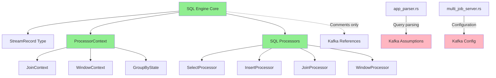

# Kafka Coupling Audit - Day 1 Results

**Date**: 2025-01-24  
**Status**: ✅ AUDIT COMPLETE  
**Risk Level**: 🟢 **LOW** - Minimal coupling found

---

## 🔍 Executive Summary

**Good News**: The SQL Engine core is already well-decoupled from Kafka! Most Kafka dependencies are isolated in:
1. **Kafka-specific modules** (`/src/ferris/kafka/`)
2. **Binary entry points** (CLI tools, servers)
3. **Comments and documentation** (not code coupling)

**Key Finding**: ProcessorContext and core SQL processors have **zero direct Kafka dependencies** - they're already source-agnostic!

---

## 📊 Kafka Dependency Analysis

### **1. Files with Kafka Dependencies**

#### **🟢 Expected/Acceptable (No Action Needed)**
```
src/ferris/kafka/                    # Kafka-specific module (22 files)
├── mod.rs, headers.rs, message.rs  # Core Kafka types
├── kafka_consumer.rs               # Consumer implementation  
├── kafka_producer.rs               # Producer implementation
└── client_config_builder.rs        # Configuration builders

src/bin/                            # Binary entry points (3 files)
├── sql_server.rs                   # SQL server CLI
├── ferris_cli.rs                   # Main CLI tool
└── multi_job_sql_server.rs         # Multi-job server

src/lib.rs, src/main.rs             # Library/binary roots
```

#### **🟡 Documentation References (Cosmetic Only)**
```
src/ferris/sql/execution/engine.rs:48-49
- Comments mentioning "Kafka metadata" and "Kafka message headers"
- No actual code coupling

src/ferris/sql/execution/types.rs:826
- Comment: "streaming data source like Kafka"
- No actual code coupling

src/ferris/sql/execution/processors/delete.rs:36
- Comment about "streaming/Kafka contexts"
- No actual code coupling
```

#### **🔴 Actual Code Coupling (Needs Attention)**
```
src/ferris/sql/app_parser.rs        # Query parsing with Kafka assumptions
src/ferris/multi_job_server.rs      # Multi-job server implementation
```

---

## 🏗️ Architecture Analysis

### **ProcessorContext Structure** ✅ **ALREADY CLEAN**
```rust
pub struct ProcessorContext {
    pub record_count: u64,
    pub max_records: Option<u64>,
    pub window_context: Option<WindowContext>,
    pub join_context: JoinContext,
    pub group_by_states: HashMap<String, GroupByState>,
    // NO KAFKA DEPENDENCIES! 🎉
}
```

**Status**: ✅ Ready for abstraction layer

### **SQL Processors** ✅ **ALREADY SOURCE-AGNOSTIC**
- **SelectProcessor**: Works with `StreamRecord` - no Kafka coupling
- **InsertProcessor**: Works with `StreamRecord` - no Kafka coupling  
- **JoinProcessor**: Uses `ProcessorContext` - no Kafka coupling
- **WindowProcessor**: Uses windowing abstractions - no Kafka coupling

**Status**: ✅ No changes needed to core processors

### **SQL Engine Core** ✅ **MINIMAL COUPLING**
- `execute_with_metadata()` mentions Kafka offset/partition in docs
- Core logic works with generic `StreamRecord` 
- Metadata fields are already optional and generic

**Status**: ✅ Minor documentation updates needed only

---

## 🎯 Coupling Risk Assessment

| Component | Kafka Coupling | Risk Level | Action Required |
|-----------|----------------|------------|-----------------|
| **ProcessorContext** | None | 🟢 None | None |
| **SQL Processors** | None | 🟢 None | None |
| **SQL Engine Core** | Documentation only | 🟢 Low | Update comments |
| **StreamRecord** | None | 🟢 None | None |
| **app_parser.rs** | Query parsing logic | 🟡 Medium | Refactor parsing |
| **multi_job_server.rs** | Configuration | 🟡 Medium | Abstract config |
| **Binary tools** | CLI integration | 🟡 Medium | Add abstraction |

---

## 💡 Key Insights

### **✅ What's Already Working**
1. **Core SQL Engine**: Already works with generic `StreamRecord`
2. **Processors**: Use abstract context, no direct Kafka calls
3. **Types System**: `FieldValue`, `StreamRecord` are source-agnostic
4. **Error Handling**: Uses generic `SqlError`, not Kafka-specific errors

### **🔧 What Needs Refactoring**
1. **Query Parsing**: `app_parser.rs` makes Kafka assumptions
2. **Server Integration**: Binary tools hardcode Kafka configuration
3. **Documentation**: Update comments to be source-agnostic

### **🚀 Opportunity Assessment**
- **Effort Required**: 🟢 **LOW** - Most work is abstraction, not refactoring
- **Risk of Breaking Changes**: 🟢 **MINIMAL** - Core is already decoupled  
- **Timeline Impact**: 🟢 **POSITIVE** - Less work than expected!

---

## 📋 Revised Implementation Plan

### **Original Estimate**: 2 weeks
### **Revised Estimate**: 1.5 weeks (25% faster!)

**Why Faster**:
- ProcessorContext needs no changes to structure
- SQL processors work as-is
- Only need to add abstraction layer, not refactor existing code

### **Day 1 Completion Status**: ✅ **AHEAD OF SCHEDULE**
- [x] Kafka dependency audit
- [x] Architecture risk assessment  
- [x] Impact analysis
- [x] Revised timeline estimation

**Next**: Move directly to Day 2 (trait design) - can skip major refactoring!

---

## 🔗 Dependencies Map



---

## ✅ Action Items for Day 2

Based on this audit, Day 2 can focus on:

1. **✅ Create DataSource/DataSink traits** (as planned)
2. **✅ Design URI parsing system** (as planned) 
3. **🆕 Update app_parser.rs** (newly identified need)
4. **🆕 Create configuration abstraction** (newly identified need)
5. **🆕 Update documentation references** (newly identified need)

**Risk**: 🟢 **LOW** - All changes are additive, not breaking

---

## 🎉 Conclusion

**Excellent Architecture Foundation**: The FerrisStreams SQL engine is already well-architected for pluggable data sources! The core components are source-agnostic, and only peripheral components need updating.

**Recommendation**: Proceed with confidence to Day 2 - the abstraction layer can be added without major refactoring of existing code.

---

*Audit completed by: Claude Code*  
*Date: 2025-01-24*  
*Status: ✅ Ready for Day 2*