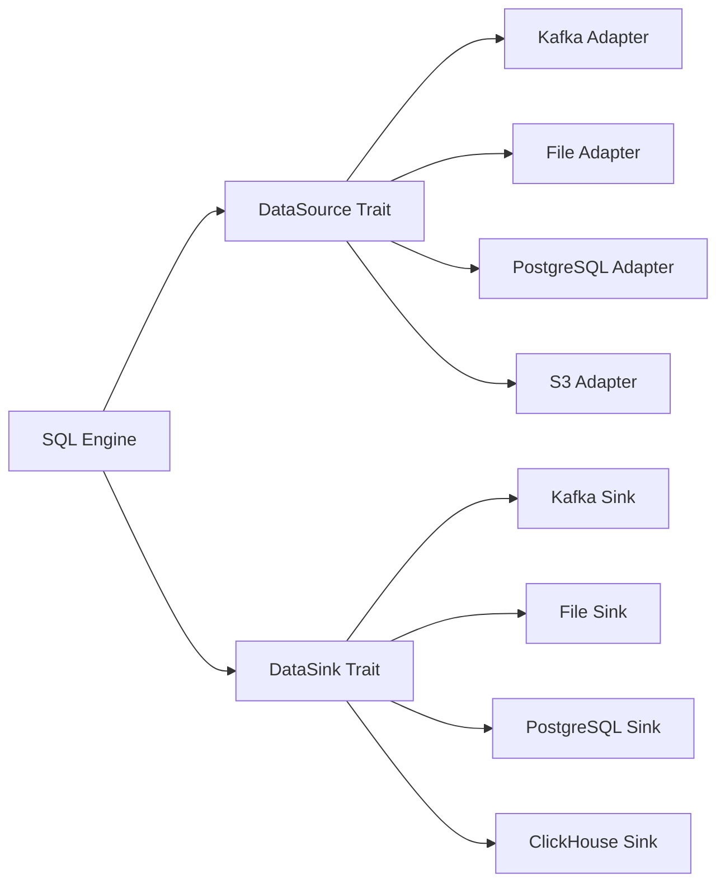

# Developer Guide: Implementing New Data Sources

This guide shows how to implement new data source adapters using the Velostream pluggable architecture.

## 📋 Overview

The pluggable data sources architecture uses four core traits:
- **`DataSource`** - Input sources (files, databases, APIs)
- **`DataSink`** - Output destinations (databases, files, APIs)  
- **`DataReader`** - Reading records from sources
- **`DataWriter`** - Writing records to sinks

## 🏗️ Architecture



## 🚀 Quick Start: File Data Source

Let's implement a CSV file data source step by step:

### Step 1: Define the Data Source

```rust
use crate::velo::sql::datasource::{
    DataSource, DataReader, SourceConfig, SourceMetadata
};
use crate::velo::sql::schema::Schema;
use crate::velo::sql::execution::types::StreamRecord;
use async_trait::async_trait;
use std::error::Error;

pub struct CsvFileDataSource {
    file_path: String,
    delimiter: char,
    has_header: bool,
    schema: Option<Schema>,
}

impl CsvFileDataSource {
    pub fn new(file_path: String) -> Self {
        Self {
            file_path,
            delimiter: ',',
            has_header: true,
            schema: None,
        }
    }
    
    pub fn with_delimiter(mut self, delimiter: char) -> Self {
        self.delimiter = delimiter;
        self
    }
    
    pub fn with_header(mut self, has_header: bool) -> Self {
        self.has_header = has_header;
        self
    }
}
```

### Step 2: Implement DataSource Trait

```rust
#[async_trait]
impl DataSource for CsvFileDataSource {
    async fn initialize(
        &mut self,
        config: SourceConfig,
    ) -> Result<(), Box<dyn Error + Send + Sync>> {
        match config {
            SourceConfig::File { path, format, properties } => {
                self.file_path = path;
                
                // Parse delimiter from properties
                if let Some(delimiter) = properties.get("delimiter") {
                    self.delimiter = delimiter.chars().next().unwrap_or(',');
                }
                
                // Parse header setting
                if let Some(header) = properties.get("header") {
                    self.has_header = header.parse().unwrap_or(true);
                }
                
                Ok(())
            }
            _ => Err("Expected File configuration".into()),
        }
    }

    async fn fetch_schema(&self) -> Result<Schema, Box<dyn Error + Send + Sync>> {
        // Read first few rows to infer schema
        let file = std::fs::File::open(&self.file_path)?;
        let mut reader = csv::ReaderBuilder::new()
            .delimiter(self.delimiter as u8)
            .has_headers(self.has_header)
            .from_reader(file);
            
        // Infer schema from first record
        let mut fields = Vec::new();
        if let Some(headers) = reader.headers().ok() {
            for header in headers {
                fields.push(FieldDefinition::optional(
                    header.to_string(),
                    DataType::String, // Simple: treat all as strings initially
                ));
            }
        }
        
        Ok(Schema::new(fields))
    }

    async fn create_reader(&self) -> Result<Box<dyn DataReader>, Box<dyn Error + Send + Sync>> {
        let reader = CsvFileDataReader::new(
            &self.file_path,
            self.delimiter,
            self.has_header,
        )?;
        Ok(Box::new(reader))
    }

    fn supports_streaming(&self) -> bool {
        true // CSV files can be read as streams
    }

    fn supports_batch(&self) -> bool {
        true // CSV files are naturally batch-oriented
    }

    fn metadata(&self) -> SourceMetadata {
        SourceMetadata {
            source_type: "csv_file".to_string(),
            version: "1.0.0".to_string(),
            supports_streaming: true,
            supports_batch: true,
            supports_schema_evolution: false, // CSV schema is fixed
            capabilities: vec![
                "local_files".to_string(),
                "schema_inference".to_string(),
                "custom_delimiters".to_string(),
            ],
        }
    }
}
```

### Step 3: Implement DataReader

```rust
use csv::Reader;
use std::fs::File;

pub struct CsvFileDataReader {
    reader: Reader<File>,
    headers: Vec<String>,
    row_number: u64,
}

impl CsvFileDataReader {
    pub fn new(
        file_path: &str,
        delimiter: char,
        has_header: bool,
    ) -> Result<Self, Box<dyn Error + Send + Sync>> {
        let file = File::open(file_path)?;
        let mut reader = csv::ReaderBuilder::new()
            .delimiter(delimiter as u8)
            .has_headers(has_header)
            .from_reader(file);
            
        // Get headers
        let headers = if has_header {
            reader.headers()?.iter().map(|h| h.to_string()).collect()
        } else {
            // Generate column names: col_0, col_1, etc.
            (0..reader.headers()?.len())
                .map(|i| format!("col_{}", i))
                .collect()
        };
        
        Ok(Self {
            reader,
            headers,
            row_number: 0,
        })
    }
}

#[async_trait]
impl DataReader for CsvFileDataReader {
    async fn read(&mut self) -> Result<Option<StreamRecord>, Box<dyn Error + Send + Sync>> {
        let mut record = csv::StringRecord::new();
        
        match self.reader.read_record(&mut record) {
            Ok(true) => {
                // Convert CSV record to StreamRecord
                let mut fields = HashMap::new();
                
                for (i, value) in record.iter().enumerate() {
                    if let Some(header) = self.headers.get(i) {
                        fields.insert(header.clone(), FieldValue::String(value.to_string()));
                    }
                }
                
                self.row_number += 1;
                
                let stream_record = StreamRecord {
                    fields,
                    timestamp: chrono::Utc::now().timestamp_millis(),
                    offset: self.row_number as i64,
                    partition: 0, // Files have single partition
                    headers: HashMap::new(),
                };
                
                Ok(Some(stream_record))
            }
            Ok(false) => Ok(None), // End of file
            Err(e) => Err(Box::new(e)),
        }
    }

    async fn read_batch(
        &mut self,
        max_size: usize,
    ) -> Result<Vec<StreamRecord>, Box<dyn Error + Send + Sync>> {
        let mut records = Vec::with_capacity(max_size);
        
        for _ in 0..max_size {
            match self.read().await? {
                Some(record) => records.push(record),
                None => break, // End of file
            }
        }
        
        Ok(records)
    }

    async fn commit(&mut self) -> Result<(), Box<dyn Error + Send + Sync>> {
        // Files don't need commit (no transactions)
        Ok(())
    }

    async fn seek(&mut self, offset: SourceOffset) -> Result<(), Box<dyn Error + Send + Sync>> {
        match offset {
            SourceOffset::File { line_number, .. } => {
                // Reset reader and skip to line
                // (Simplified - in production, use indexed seeking)
                Err("Seek not yet implemented for CSV files".into())
            }
            _ => Err("Invalid offset type for file source".into()),
        }
    }

    async fn has_more(&self) -> Result<bool, Box<dyn Error + Send + Sync>> {
        // For files, we can't easily check without reading
        // Return true and rely on read() returning None at EOF
        Ok(true)
    }
}
```

### Step 4: Registration

```rust
// Register with the data source registry
use crate::velo::sql::datasource::registry::DataSourceRegistry;

pub fn register_csv_source(registry: &mut DataSourceRegistry) {
    registry.register_source("csv", |uri: &str| {
        // Parse URI to extract file path and parameters
        let conn = ConnectionString::parse(uri)?;
        
        let mut source = CsvFileDataSource::new(conn.path);
        
        // Configure based on URI parameters
        if let Some(delimiter) = conn.params.get("delimiter") {
            if let Some(d) = delimiter.chars().next() {
                source = source.with_delimiter(d);
            }
        }
        
        if let Some(header) = conn.params.get("header") {
            source = source.with_header(header.parse().unwrap_or(true));
        }
        
        Ok(Box::new(source))
    });
}
```

## 🔧 Complete Example: PostgreSQL Data Source

Here's a more advanced example implementing a PostgreSQL CDC data source:

```rust
use tokio_postgres::{Client, NoTls};
use futures_util::StreamExt;

pub struct PostgreSqlCdcDataSource {
    connection_string: String,
    table: String,
    replication_slot: String,
    client: Option<Client>,
}

impl PostgreSqlCdcDataSource {
    pub fn new(connection_string: String, table: String) -> Self {
        Self {
            connection_string,
            table,
            replication_slot: format!("velo_cdc_{}", table),
            client: None,
        }
    }
}

#[async_trait]
impl DataSource for PostgreSqlCdcDataSource {
    async fn initialize(
        &mut self,
        config: SourceConfig,
    ) -> Result<(), Box<dyn Error + Send + Sync>> {
        match config {
            SourceConfig::Database { connection_string, table, .. } => {
                self.connection_string = connection_string;
                self.table = table;
                
                // Connect to PostgreSQL
                let (client, connection) = tokio_postgres::connect(&self.connection_string, NoTls).await?;
                
                // Spawn connection handler
                tokio::spawn(async move {
                    if let Err(e) = connection.await {
                        eprintln!("PostgreSQL connection error: {}", e);
                    }
                });
                
                // Create replication slot if needed
                client.execute(
                    &format!("SELECT pg_create_logical_replication_slot('{}', 'pgoutput')", 
                             self.replication_slot),
                    &[],
                ).await.ok(); // Ignore if already exists
                
                self.client = Some(client);
                Ok(())
            }
            _ => Err("Expected Database configuration".into()),
        }
    }

    async fn fetch_schema(&self) -> Result<Schema, Box<dyn Error + Send + Sync>> {
        let client = self.client.as_ref().ok_or("Not initialized")?;
        
        // Query table schema
        let rows = client.query(
            "SELECT column_name, data_type, is_nullable 
             FROM information_schema.columns 
             WHERE table_name = $1 
             ORDER BY ordinal_position",
            &[&self.table],
        ).await?;
        
        let mut fields = Vec::new();
        for row in rows {
            let column_name: String = row.get(0);
            let data_type: String = row.get(1);
            let is_nullable: String = row.get(2);
            
            let velo_type = match data_type.as_str() {
                "integer" | "bigint" => DataType::Integer,
                "text" | "varchar" => DataType::String,
                "boolean" => DataType::Boolean,
                "timestamp" | "timestamptz" => DataType::Timestamp,
                "numeric" | "decimal" => DataType::Float,
                _ => DataType::String, // Default fallback
            };
            
            let nullable = is_nullable == "YES";
            fields.push(FieldDefinition::new(column_name, velo_type, nullable));
        }
        
        Ok(Schema::new(fields))
    }

    async fn create_reader(&self) -> Result<Box<dyn DataReader>, Box<dyn Error + Send + Sync>> {
        let reader = PostgreSqlCdcDataReader::new(
            &self.connection_string,
            &self.table,
            &self.replication_slot,
        ).await?;
        Ok(Box::new(reader))
    }

    fn supports_streaming(&self) -> bool {
        true // CDC is naturally streaming
    }

    fn supports_batch(&self) -> bool {
        false // CDC is real-time only
    }

    fn metadata(&self) -> SourceMetadata {
        SourceMetadata {
            source_type: "postgresql_cdc".to_string(),
            version: "1.0.0".to_string(),
            supports_streaming: true,
            supports_batch: false,
            supports_schema_evolution: true,
            capabilities: vec![
                "change_data_capture".to_string(),
                "real_time".to_string(),
                "schema_evolution".to_string(),
                "transactional".to_string(),
            ],
        }
    }
}
```

## 📋 Implementation Checklist

### Required Components
- [ ] **Data Source struct** with configuration fields
- [ ] **DataSource trait implementation**
  - [ ] `initialize()` - Setup and configuration
  - [ ] `fetch_schema()` - Schema discovery/inference  
  - [ ] `create_reader()` - Reader factory method
  - [ ] `supports_streaming()` - Streaming capability flag
  - [ ] `supports_batch()` - Batch processing flag
  - [ ] `metadata()` - Source metadata and capabilities
- [ ] **DataReader implementation**
  - [ ] `read()` - Single record reading
  - [ ] `read_batch()` - Batch record reading
  - [ ] `commit()` - Transaction commit (if applicable)
  - [ ] `seek()` - Offset/position seeking (if applicable)
  - [ ] `has_more()` - Data availability check
- [ ] **Registration** - Register with DataSourceRegistry
- [ ] **Error handling** - Proper error types and handling
- [ ] **Tests** - Unit and integration tests

### Optional Components
- [ ] **DataSink implementation** (for output)
- [ ] **DataWriter implementation** (for writing)
- [ ] **Configuration validation** - Parameter validation
- [ ] **Schema evolution** - Handle schema changes
- [ ] **Performance optimization** - Batching, connection pooling
- [ ] **Monitoring** - Metrics and health checks

## 🧪 Testing Your Implementation

```rust
#[cfg(test)]
mod tests {
    use super::*;
    use tempfile::NamedTempFile;
    use std::io::Write;

    #[tokio::test]
    async fn test_csv_data_source() {
        // Create test CSV file
        let mut file = NamedTempFile::new().unwrap();
        writeln!(file, "name,age,city").unwrap();
        writeln!(file, "Alice,30,NYC").unwrap();
        writeln!(file, "Bob,25,LA").unwrap();
        
        // Create data source
        let mut source = CsvFileDataSource::new(file.path().to_string_lossy().to_string());
        
        // Test schema discovery
        let schema = source.fetch_schema().await.unwrap();
        assert_eq!(schema.fields.len(), 3);
        assert_eq!(schema.fields[0].name, "name");
        
        // Test reading
        let mut reader = source.create_reader().await.unwrap();
        let record1 = reader.read().await.unwrap().unwrap();
        assert_eq!(record1.fields.get("name").unwrap(), &FieldValue::String("Alice".to_string()));
        
        let record2 = reader.read().await.unwrap().unwrap();
        assert_eq!(record2.fields.get("name").unwrap(), &FieldValue::String("Bob".to_string()));
        
        let eof = reader.read().await.unwrap();
        assert!(eof.is_none());
    }
    
    #[tokio::test]
    async fn test_batch_reading() {
        // Create larger test file
        let mut file = NamedTempFile::new().unwrap();
        writeln!(file, "id,value").unwrap();
        for i in 0..100 {
            writeln!(file, "{},{}", i, i * 2).unwrap();
        }
        
        let mut source = CsvFileDataSource::new(file.path().to_string_lossy().to_string());
        let mut reader = source.create_reader().await.unwrap();
        
        // Test batch reading
        let batch = reader.read_batch(10).await.unwrap();
        assert_eq!(batch.len(), 10);
        
        let first_record = &batch[0];
        assert_eq!(first_record.fields.get("id").unwrap(), &FieldValue::String("0".to_string()));
    }
}
```

## 🎯 Best Practices

### 1. **Error Handling**
```rust
// Use specific error types
#[derive(Debug)]
pub enum CsvSourceError {
    FileNotFound(String),
    InvalidDelimiter(char),
    SchemaInference(String),
    Io(std::io::Error),
}

impl From<std::io::Error> for CsvSourceError {
    fn from(err: std::io::Error) -> Self {
        CsvSourceError::Io(err)
    }
}
```

### 2. **Configuration Validation**
```rust
impl CsvFileDataSource {
    fn validate_config(&self) -> Result<(), CsvSourceError> {
        if !std::path::Path::new(&self.file_path).exists() {
            return Err(CsvSourceError::FileNotFound(self.file_path.clone()));
        }
        
        if !self.delimiter.is_ascii() {
            return Err(CsvSourceError::InvalidDelimiter(self.delimiter));
        }
        
        Ok(())
    }
}
```

### 3. **Resource Management**
```rust
impl Drop for CsvFileDataReader {
    fn drop(&mut self) {
        // Clean up resources
        // Close files, connections, etc.
    }
}
```

### 4. **Performance Optimization**
```rust
// Use buffered readers for better performance
use std::io::BufReader;

let file = File::open(file_path)?;
let buf_reader = BufReader::with_capacity(64 * 1024, file); // 64KB buffer
let csv_reader = csv::Reader::from_reader(buf_reader);
```

## 📚 Examples Repository

### File-based Sources
- **CSV**: Comma-separated values with custom delimiters
- **JSON**: JSON objects and JSON-Lines format
- **Parquet**: Columnar format for analytics
- **Avro**: Schema-evolution friendly format

### Database Sources  
- **PostgreSQL CDC**: Change data capture using logical replication
- **MySQL Binlog**: Real-time change streaming
- **ClickHouse**: Columnar OLAP queries
- **MongoDB**: Document database with change streams

### Cloud Sources
- **S3**: Object storage with multiple format support
- **Google Cloud Storage**: GCS object processing
- **Azure Blob**: Azure storage integration
- **Kafka Connect**: Connector-based integration

## 🚀 Next Steps

1. **Choose your data source** type (file, database, cloud, API)
2. **Follow the implementation checklist** above
3. **Write comprehensive tests** for your implementation
4. **Register with the DataSourceRegistry**
5. **Submit a pull request** to add your data source to Velostream

The pluggable architecture makes it easy to add new data sources while maintaining compatibility with the existing ecosystem.

---

## 📍 Position Tracking and Updates

Different data sources handle position tracking and updates in various ways. This section explains how each source type maintains its read position and handles new data arrivals.

### Position Tracking Mechanisms

#### 1. **Kafka - Offset-Based Tracking**

Kafka uses consumer group offsets to track position:

```rust
pub enum SourceOffset {
    Kafka { 
        partition: i32,  // Which partition
        offset: i64      // Message offset within partition
    },
    // ...
}
```

**How it works:**
- Each consumer maintains an offset per partition
- Offsets are committed to Kafka's internal `__consumer_offsets` topic
- On restart, consumers resume from last committed offset
- Supports manual offset management via `seek()`

**Update Detection:**
- Kafka brokers push new messages to consumers
- Consumer polls continuously for new data
- Real-time updates with minimal latency
- No need to check for file changes

**Example:**
```rust
// Kafka reader automatically tracks position
let mut reader = kafka_source.create_reader().await?;
while let Some(record) = reader.read().await? {
    process_record(record);
    reader.commit().await?;  // Commit offset after processing
}

// Resume from specific offset after failure
reader.seek(SourceOffset::Kafka { 
    partition: 0, 
    offset: 12345 
}).await?;
```

#### 2. **File - Byte Offset & Line Tracking**

Files use multiple position indicators:

```rust
pub enum SourceOffset {
    File {
        path: String,        // File path
        byte_offset: u64,    // Byte position in file
        line_number: u64,    // Line number (for line-based formats)
    },
    // ...
}
```

**How it works:**
- Maintains both byte offset and line number
- Stores position in external checkpoint file or database
- On restart, seeks to last known position
- Handles file rotation and truncation

**Update Detection Strategies:**

##### **A. Tail Mode (Like `tail -f`)**
```rust
impl FileReader {
    async fn read_continuous(&mut self) -> Result<Option<StreamRecord>> {
        loop {
            // Try reading from current position
            if let Some(line) = self.read_line()? {
                self.byte_offset += line.len() as u64;
                self.line_number += 1;
                return Ok(Some(parse_record(line)?));
            }
            
            // No data available, check for changes
            let current_size = fs::metadata(&self.path)?.len();
            
            if current_size < self.byte_offset {
                // File was truncated/rotated
                self.handle_rotation().await?;
            } else if current_size > self.byte_offset {
                // New data available, continue reading
                continue;
            } else {
                // No new data, wait and retry
                tokio::time::sleep(Duration::from_millis(100)).await;
            }
        }
    }
    
    async fn handle_rotation(&mut self) -> Result<()> {
        // Check if original file still exists with different inode
        if self.check_rotated_file()? {
            // Finish reading old file
            self.read_remaining().await?;
        }
        // Reset to beginning of new file
        self.byte_offset = 0;
        self.line_number = 0;
        Ok(())
    }
}
```

##### **B. Directory Watching (For Multiple Files)**
```rust
use notify::{Watcher, RecursiveMode, watcher};

impl DirectorySource {
    async fn watch_for_updates(&mut self) {
        let (tx, rx) = channel();
        let mut watcher = watcher(tx, Duration::from_secs(1))?;
        watcher.watch(&self.dir_path, RecursiveMode::NonRecursive)?;
        
        loop {
            match rx.recv() {
                Ok(DebouncedEvent::Create(path)) => {
                    // New file created
                    self.add_file_to_queue(path);
                }
                Ok(DebouncedEvent::Write(path)) => {
                    // Existing file modified
                    self.mark_file_updated(path);
                }
                Ok(DebouncedEvent::Rename(old, new)) => {
                    // File rotated
                    self.handle_rename(old, new);
                }
                _ => {}
            }
        }
    }
}
```

##### **C. Checkpoint-Based Recovery**
```rust
struct FileCheckpoint {
    file_path: String,
    byte_offset: u64,
    line_number: u64,
    file_hash: String,  // To detect file replacement
    last_modified: SystemTime,
}

impl FileReader {
    async fn save_checkpoint(&self) -> Result<()> {
        let checkpoint = FileCheckpoint {
            file_path: self.path.clone(),
            byte_offset: self.byte_offset,
            line_number: self.line_number,
            file_hash: self.calculate_file_hash()?,
            last_modified: fs::metadata(&self.path)?.modified()?,
        };
        
        // Save to checkpoint storage (file, database, etc.)
        self.checkpoint_store.save(&checkpoint).await?;
        Ok(())
    }
    
    async fn restore_from_checkpoint(&mut self) -> Result<()> {
        if let Some(checkpoint) = self.checkpoint_store.load(&self.path).await? {
            // Verify file hasn't been replaced
            if self.calculate_file_hash()? == checkpoint.file_hash {
                // Seek to saved position
                self.file.seek(SeekFrom::Start(checkpoint.byte_offset))?;
                self.byte_offset = checkpoint.byte_offset;
                self.line_number = checkpoint.line_number;
            } else {
                // File was replaced, start from beginning
                self.byte_offset = 0;
                self.line_number = 0;
            }
        }
        Ok(())
    }
}
```

#### 3. **S3 - Object & Byte Offset Tracking**

S3 uses bucket, key, and byte offset:

```rust
pub enum SourceOffset {
    S3 {
        bucket: String,
        key: String,
        byte_offset: u64,
    },
    // ...
}
```

**How it works:**
- Tracks position within individual S3 objects
- Maintains list of processed objects
- Handles new objects via prefix listing

**Update Detection:**

```rust
impl S3Source {
    async fn poll_for_updates(&mut self) -> Result<Vec<String>> {
        let mut new_objects = Vec::new();
        
        // List objects with prefix
        let objects = self.s3_client
            .list_objects_v2()
            .bucket(&self.bucket)
            .prefix(&self.prefix)
            .send()
            .await?;
        
        for object in objects.contents.unwrap_or_default() {
            let key = object.key.unwrap();
            
            // Check if object is new or updated
            if !self.processed_objects.contains(&key) {
                new_objects.push(key.clone());
                self.processed_objects.insert(key);
            } else if let Some(last_modified) = object.last_modified {
                // Check if object was updated
                if last_modified > self.last_check_time {
                    new_objects.push(key);
                }
            }
        }
        
        self.last_check_time = Utc::now();
        Ok(new_objects)
    }
}
```

#### 4. **Database - Cursor & Change Data Capture**

Databases use various strategies:

```rust
pub enum SourceOffset {
    Database {
        table: String,
        cursor: DatabaseCursor,
    },
    // ...
}

pub enum DatabaseCursor {
    // For incremental reads
    PrimaryKey(Vec<FieldValue>),
    
    // For timestamp-based reads
    Timestamp(DateTime<Utc>),
    
    // For CDC (Change Data Capture)
    LogSequenceNumber(String),
    
    // For cursor-based pagination
    ServerCursor(String),
}
```

**Update Detection Strategies:**

##### **A. Incremental Timestamp-Based**
```rust
impl DatabaseSource {
    async fn read_incremental(&mut self) -> Result<Vec<StreamRecord>> {
        let query = format!(
            "SELECT * FROM {} WHERE updated_at > ? ORDER BY updated_at LIMIT 1000",
            self.table
        );
        
        let rows = self.connection
            .query(&query, &[&self.last_timestamp])
            .await?;
        
        if let Some(last_row) = rows.last() {
            self.last_timestamp = last_row.get("updated_at");
        }
        
        Ok(rows.into_iter().map(|r| r.into()).collect())
    }
}
```

##### **B. Change Data Capture (CDC)**
```rust
impl CDCSource {
    async fn read_changes(&mut self) -> Result<Vec<ChangeEvent>> {
        // Read from database transaction log
        let changes = self.cdc_client
            .read_changes_since(&self.last_lsn)
            .await?;
        
        for change in &changes {
            self.last_lsn = change.lsn.clone();
            
            match change.operation {
                Operation::Insert => self.handle_insert(change),
                Operation::Update => self.handle_update(change),
                Operation::Delete => self.handle_delete(change),
            }
        }
        
        Ok(changes)
    }
}
```

### Position Tracking Comparison Table

| Source Type | Position Tracking | Update Detection | Recovery Method | Latency |
|-------------|------------------|------------------|-----------------|------------|
| **Kafka** | Consumer group offsets | Push-based (broker pushes) | Resume from last offset | Real-time (ms) |
| **File** | Byte offset + line number | Polling or inotify watching | Checkpoint files | Near real-time (100ms) |
| **S3** | Object key + byte offset | Periodic listing | Processed object list | Polling interval (seconds) |
| **Database** | Cursor/timestamp/LSN | Polling or CDC triggers | Last processed ID/time | Varies (ms to seconds) |

---

## 🔄 Update Frequency and Interaction Models

Different data sources have fundamentally different interaction models for handling updates. This affects latency, resource usage, and the overall streaming architecture.

### Interaction Model Categories

#### 1. **Push Model** - Data is pushed to consumers
- **Example**: Kafka, Message Queues, WebSockets
- **Latency**: Milliseconds to seconds
- **Resource**: Low CPU (event-driven)
- **Blocking**: Non-blocking for new data

#### 2. **Pull Model** - Consumer polls for data
- **Example**: Files, Databases, REST APIs
- **Latency**: Polling interval dependent
- **Resource**: Higher CPU (continuous polling)
- **Blocking**: May block waiting for data

#### 3. **Hybrid Model** - Push notifications + Pull data
- **Example**: Database triggers + polling, S3 events + object fetching
- **Latency**: Near real-time notifications
- **Resource**: Medium (event-driven + periodic)
- **Blocking**: Non-blocking notifications, blocking data fetch

### Detailed Interaction Models

#### 📡 **Kafka - Pure Push Model**

```rust
impl KafkaReader {
    async fn read(&mut self) -> Result<Option<StreamRecord>> {
        // Non-blocking check for immediate data
        if let Some(message) = self.consumer.poll(Duration::from_millis(0))? {
            return Ok(Some(message.into()));
        }
        
        // Block waiting for new data (with timeout)
        match self.consumer.poll(self.poll_timeout).await? {
            Some(message) => Ok(Some(message.into())),
            None => Ok(None), // Timeout reached, no data
        }
    }
}

// Configuration
struct KafkaConfig {
    poll_timeout: Duration,           // 100ms - 5s typical
    max_poll_records: u32,            // Batch size: 100-10000
    enable_auto_commit: bool,         // Auto-commit offsets
    auto_commit_interval: Duration,   // 5s typical
}
```

**Characteristics:**
- **Update Frequency**: Real-time (< 10ms typical)
- **Blocking Behavior**: Blocks on `poll()` until data arrives or timeout
- **Resource Usage**: Low - broker pushes data efficiently
- **Scalability**: Excellent - broker handles fan-out

#### 📁 **File Sources - Pull Model with Multiple Strategies**

##### **Strategy 1: Polling (Simple but Inefficient)**

```rust
impl FilePollingReader {
    async fn read(&mut self) -> Result<Option<StreamRecord>> {
        loop {
            // Try to read from current position
            if let Some(record) = self.try_read_line()? {
                return Ok(Some(record));
            }
            
            // No data - check if file grew
            let current_size = fs::metadata(&self.path)?.len();
            if current_size > self.last_known_size {
                self.last_known_size = current_size;
                continue; // Try reading again
            }
            
            // No new data - wait and retry
            tokio::time::sleep(self.poll_interval).await;
        }
    }
}

// Configuration
struct FilePollingConfig {
    poll_interval: Duration,     // 100ms - 5s (trade-off: latency vs CPU)
    max_read_batch: usize,       // Read multiple lines per poll
    stat_file_every_poll: bool,  // Check file size every poll (expensive)
}
```

**Characteristics:**
- **Update Frequency**: Poll interval (100ms - 5s)
- **Blocking**: Blocks on sleep between polls
- **CPU Usage**: High - continuous file system calls
- **Latency**: Poll interval + processing time

##### **Strategy 2: File System Events (Efficient)**

```rust
use notify::{Watcher, RecommendedWatcher, Event, EventKind};

impl FileEventReader {
    async fn read(&mut self) -> Result<Option<StreamRecord>> {
        // Check if we have buffered data first
        if let Some(record) = self.buffer.pop_front() {
            return Ok(Some(record));
        }
        
        // Wait for file system event or timeout
        tokio::select! {
            event = self.event_receiver.recv() => {
                match event? {
                    Event { kind: EventKind::Modify(_), .. } => {
                        // File was modified - read new data
                        self.read_new_data().await?;
                        Ok(self.buffer.pop_front())
                    }
                    Event { kind: EventKind::Create(_), .. } => {
                        // New file created (log rotation)
                        self.handle_rotation().await?;
                        Ok(None)
                    }
                    _ => Ok(None)
                }
            }
            _ = tokio::time::sleep(self.read_timeout) => {
                // Timeout - return None to allow other processing
                Ok(None)
            }
        }
    }
}
```

**Characteristics:**
- **Update Frequency**: Near real-time (< 100ms)
- **Blocking**: Minimal - only on actual I/O
- **CPU Usage**: Low - event-driven
- **Latency**: File system event delay + read time

#### 🗄️ **Database Sources - Multiple Interaction Models**

##### **Strategy 1: Polling with Timestamps**

```rust
impl DatabasePollingReader {
    async fn read(&mut self) -> Result<Option<StreamRecord>> {
        // Query for new/updated records
        let query = format!(
            "SELECT * FROM {} WHERE updated_at > ? ORDER BY updated_at LIMIT ?",
            self.table, self.batch_size
        );
        
        let rows = self.connection
            .query(&query, &[&self.last_timestamp])
            .await?;
        
        if rows.is_empty() {
            // No new data - wait before next poll
            tokio::time::sleep(self.poll_interval).await;
            return Ok(None);
        }
        
        // Process batch and update cursor
        self.current_batch = rows.into_iter().map(|r| r.into()).collect();
        if let Some(last_record) = self.current_batch.last() {
            self.last_timestamp = last_record.get_timestamp("updated_at")?;
        }
        
        Ok(self.current_batch.pop())
    }
}

// Configuration
struct DatabasePollingConfig {
    poll_interval: Duration,      // 1s - 30s typical
    batch_size: usize,           // 100 - 10000 records
    timestamp_column: String,     // "updated_at", "created_at"
    query_timeout: Duration,      // 30s
    connection_pool_size: u32,    // 5-20 connections
}
```

**Characteristics:**
- **Update Frequency**: Poll interval (1-30 seconds)
- **Blocking**: Blocks on database query (potentially long)
- **Database Load**: Moderate - periodic SELECT queries
- **Latency**: Poll interval + query time

##### **Strategy 2: Database Change Data Capture (CDC)**

```rust
impl DatabaseCDCReader {
    async fn read(&mut self) -> Result<Option<StreamRecord>> {
        // Read from database transaction log or CDC stream
        match self.cdc_client.read_change().await? {
            Some(change) => {
                let record = self.convert_change_to_record(change)?;
                Ok(Some(record))
            }
            None => {
                // No changes available - brief wait
                tokio::time::sleep(Duration::from_millis(10)).await;
                Ok(None)
            }
        }
    }
}

// Different CDC implementations
enum CDCMethod {
    // Postgres logical replication
    PostgresLogical {
        slot_name: String,
        publication: String,
    },
    
    // MySQL binlog
    MySQLBinlog {
        server_id: u32,
        binlog_file: String,
        position: u64,
    },
    
    // SQL Server Change Tracking
    SqlServerCT {
        change_tracking_version: i64,
    },
    
    // Debezium connector
    Debezium {
        connector_name: String,
        kafka_topic: String,
    },
}
```

**Characteristics:**
- **Update Frequency**: Real-time (< 1s)
- **Blocking**: Minimal - reads from log stream
- **Database Load**: Very low - reads transaction log
- **Latency**: Transaction commit time + log read delay

#### 🌊 **S3 - Polling with Optimization**

```rust
impl S3Reader {
    async fn read(&mut self) -> Result<Option<StreamRecord>> {
        // Check if we have buffered records from current object
        if let Some(record) = self.current_object_buffer.pop() {
            return Ok(Some(record));
        }
        
        // Need to fetch next object
        if let Some(object_key) = self.get_next_unprocessed_object().await? {
            self.load_object_data(&object_key).await?;
            return Ok(self.current_object_buffer.pop());
        }
        
        // No new objects - check for new ones
        self.scan_for_new_objects().await?;
        
        if self.unprocessed_objects.is_empty() {
            // No new objects found - wait before next scan
            tokio::time::sleep(self.scan_interval).await;
            return Ok(None);
        }
        
        // Found new objects - process next one
        let object_key = self.unprocessed_objects.pop().unwrap();
        self.load_object_data(&object_key).await?;
        Ok(self.current_object_buffer.pop())
    }
}
```

### Performance and Blocking Characteristics

#### Comparison Table

| Source Type | Update Frequency | Blocking Behavior | CPU Usage | Memory Usage | Network Calls |
|-------------|------------------|-------------------|-----------|--------------|---------------|
| **Kafka** | Real-time (< 10ms) | Minimal (poll timeout) | Low | Low | Low (persistent connection) |
| **File (Polling)** | 100ms - 5s | High (sleep between polls) | High | Low | None |
| **File (Events)** | Near real-time (< 100ms) | Minimal (event wait) | Low | Low | None |
| **Database (Polling)** | 1s - 30s | High (query + sleep) | Medium | Medium | Medium (periodic queries) |
| **Database (CDC)** | Real-time (< 1s) | Minimal (log read) | Low | Low | Low (log stream) |
| **Database (Triggers)** | 1s - 10s | Medium (notification poll) | Medium | Medium | Medium (notification queries) |
| **S3** | 30s - 5m | High (list + download) | Medium | High | High (REST API calls) |

#### **Non-Blocking Sources** ✅
```rust
// Kafka - returns immediately if no data
async fn read_non_blocking(&mut self) -> Result<Option<StreamRecord>> {
    // This returns immediately
    match self.consumer.poll(Duration::from_millis(0)).await? {
        Some(msg) => Ok(Some(msg.into())),
        None => Ok(None), // No blocking
    }
}
```

#### **Blocking Sources** ⚠️
```rust
// Database polling - blocks on query
async fn read_blocking(&mut self) -> Result<Option<StreamRecord>> {
    // This can block for seconds
    let rows = self.connection.query(&self.sql, &[]).await?;  // BLOCKS HERE
    
    if rows.is_empty() {
        // This also blocks
        tokio::time::sleep(self.poll_interval).await;  // BLOCKS HERE
    }
    
    Ok(rows.into_iter().next().map(|r| r.into()))
}
```

#### **Controlled Blocking** 🎛️
```rust
// Good pattern - bounded blocking with timeouts
async fn read_with_timeout(&mut self) -> Result<Option<StreamRecord>> {
    tokio::time::timeout(
        Duration::from_secs(5),  // Maximum block time
        async {
            match self.source_type {
                SourceType::Database => self.db_query().await,
                SourceType::File => self.file_read().await,
                SourceType::S3 => self.s3_fetch().await,
            }
        }
    ).await??
}
```

### Configuration Recommendations

#### **High Frequency / Low Latency** ⚡
```yaml
kafka:
  poll_timeout: 100ms
  batch_size: 1

file:
  method: filesystem_events
  read_timeout: 500ms
  
database:
  method: cdc
  buffer_size: 100
```

#### **Medium Frequency / Balanced** ⚖️
```yaml
kafka:
  poll_timeout: 1s
  batch_size: 100

file:
  method: hybrid
  event_timeout: 1s
  fallback_poll: 5s
  
database:
  method: polling
  poll_interval: 5s
  batch_size: 1000
```

#### **Low Frequency / High Throughput** 📈
```yaml
kafka:
  poll_timeout: 5s
  batch_size: 10000

file:
  method: polling
  poll_interval: 30s
  batch_size: 5000
  
database:
  poll_interval: 60s
  batch_size: 50000

s3:
  scan_interval: 300s
  parallel_downloads: 10
```

### Integration Best Practices

#### 1. **Choose the Right Model for Your Use Case**
- **Real-time requirements**: Use push models (Kafka, CDC)
- **Batch processing**: Use pull models with longer intervals
- **Cost-sensitive**: Use longer polling intervals

#### 2. **Handle Blocking Gracefully**
```rust
// Good: Use timeouts to prevent indefinite blocking
async fn read_with_circuit_breaker(&mut self) -> Result<Option<StreamRecord>> {
    match tokio::time::timeout(self.read_timeout, self.read_internal()).await {
        Ok(result) => result,
        Err(_timeout) => {
            self.circuit_breaker.record_timeout();
            Ok(None)
        }
    }
}
```

#### 3. **Batch Operations for Efficiency**
```rust
// Better: Read multiple records per operation
async fn read_batch(&mut self, max_size: usize) -> Result<Vec<StreamRecord>> {
    let mut batch = Vec::with_capacity(max_size);
    
    // Try to fill batch without blocking
    while batch.len() < max_size {
        match self.read_non_blocking().await? {
            Some(record) => batch.push(record),
            None => break, // No more immediate data
        }
    }
    
    Ok(batch)
}
```

#### 4. **Use Appropriate Buffer Sizes**
- Small buffers: Lower latency, higher overhead
- Large buffers: Higher latency, better throughput
- Adaptive buffers: Adjust based on data rate

#### 5. **Monitor and Alert**
```rust
struct SourceMetrics {
    read_frequency: Histogram,
    blocking_duration: Histogram,
    records_per_read: Histogram,
    error_rate: Counter,
}
```

### Position Tracking Configuration Examples

#### File Source with Position Tracking

```yaml
# file_source_config.yaml
type: file
path: /data/logs/app.log
format: json
position_tracking:
  enabled: true
  checkpoint_dir: /var/lib/velo/checkpoints
  checkpoint_interval: 1000  # Save every 1000 records
  
watching:
  enabled: true
  mode: tail  # Options: tail, directory_watch, periodic_scan
  poll_interval: 100ms
  
rotation:
  detect_rotation: true
  rotation_pattern: "app.log.*"  # Handle app.log.1, app.log.2, etc.
  finish_rotated: true  # Complete reading rotated files
```

#### Kafka Source with Offset Management

```yaml
# kafka_source_config.yaml
type: kafka
brokers: ["localhost:9092"]
topic: orders
group_id: order_processor
offset_management:
  auto_commit: false  # Manual commit for exactly-once
  commit_interval: 5000ms
  reset_policy: latest  # earliest, latest, none
  
recovery:
  save_offsets_externally: true
  external_store: redis://localhost:6379
```

#### S3 Source with Incremental Processing

```yaml
# s3_source_config.yaml
type: s3
bucket: data-lake
prefix: events/2024/
format: parquet
position_tracking:
  state_file: /var/lib/velo/s3_state.json
  track_processed: true
  
scanning:
  mode: incremental  # incremental, full
  poll_interval: 30s
  max_keys_per_scan: 1000
  
filtering:
  modified_since: ${LAST_RUN_TIME}
  exclude_pattern: ".*\\.tmp$"
```

### Implementation Best Practices

#### 1. **Choose Appropriate Checkpoint Frequency**
- Too frequent: Performance overhead
- Too infrequent: More data to reprocess after failure
- Recommendation: Every 1000-10000 records or 10-30 seconds

#### 2. **Handle File Rotation Gracefully**
- Detect rotation via inode changes
- Complete reading rotated files before switching
- Maintain separate checkpoints per file

#### 3. **Implement Idempotent Processing**
- Design processing to handle duplicate records
- Use unique IDs or deduplication windows
- Important for at-least-once delivery guarantees

#### 4. **Monitor Position Lag**
```rust
impl PositionMonitor {
    fn calculate_lag(&self) -> Duration {
        match &self.source_type {
            SourceType::Kafka => {
                // Compare current offset with high water mark
                self.high_water_mark - self.current_offset
            }
            SourceType::File => {
                // Compare file size with current position
                (self.file_size - self.byte_offset) / self.avg_read_rate
            }
            SourceType::S3 => {
                // Count unprocessed objects
                self.total_objects - self.processed_objects
            }
        }
    }
}
```

#### 5. **Plan for Recovery Scenarios**
- Corrupted checkpoint files
- Source unavailability
- Network partitions
- Manual intervention needs

## 🕒 Event-Time Configuration Architecture

Velostream provides centralized event-time configuration through the `SourceConfig` enum, enabling automatic event-time extraction across all data sources without code duplication.

### Architecture Overview

Event-time configuration is handled at three levels:

1. **Configuration Parsing** - `SourceConfig` parses event-time config from URI parameters or properties
2. **Initialization** - Data sources receive `event_time_config` via `initialize()` method
3. **Record Processing** - Readers extract event-time from record fields using the config


### SourceConfig Structure

All `SourceConfig` variants include an `event_time_config` field:

```rust
pub enum SourceConfig {
    Kafka {
        brokers: String,
        topic: String,
        group_id: Option<String>,
        properties: HashMap<String, String>,
        batch_config: BatchConfig,
        event_time_config: Option<EventTimeConfig>,  // Centralized config
    },
    File {
        path: String,
        format: FileFormat,
        properties: HashMap<String, String>,
        batch_config: BatchConfig,
        event_time_config: Option<EventTimeConfig>,  // Centralized config
    },
    // Similar for S3, Database, ClickHouse, Generic...
}
```

### EventTimeConfig

The configuration struct that defines how to extract event-time from records:

```rust
pub struct EventTimeConfig {
    /// Field name containing the timestamp
    pub field_name: String,

    /// Optional format string for parsing
    pub format: Option<String>,
}

impl EventTimeConfig {
    /// Parse from properties (called by SourceConfig construction)
    pub fn from_properties(props: &HashMap<String, String>) -> Option<Self> {
        props.get("event.time.field").map(|field_name| {
            EventTimeConfig {
                field_name: field_name.clone(),
                format: props.get("event.time.format").cloned(),
            }
        })
    }
}
```

### Configuration via URI Parameters

Event-time config is automatically parsed from data source URIs:

```rust
// Kafka source with event-time extraction
let uri = "kafka://localhost:9092/trades?event.time.field=timestamp&event.time.format=iso8601";
let source_config = DataSourceUri::parse(uri)?.to_source_config()?;

// File source with event-time extraction
let uri = "file:///data/trades.json?event.time.field=trade_time&event.time.format=%Y-%m-%d %H:%M:%S";
let source_config = DataSourceUri::parse(uri)?.to_source_config()?;
```

### Implementing Event-Time Support in Custom Data Sources

#### Step 1: Store EventTimeConfig in DataSource

```rust
pub struct MyCustomDataSource {
    config: MyConfig,
    event_time_config: Option<EventTimeConfig>,  // Add this field
}
```

#### Step 2: Extract from SourceConfig in initialize()

```rust
#[async_trait]
impl DataSource for MyCustomDataSource {
    async fn initialize(
        &mut self,
        config: SourceConfig,
    ) -> Result<(), Box<dyn Error + Send + Sync>> {
        match config {
            SourceConfig::Generic {
                source_type,
                properties,
                batch_config,
                event_time_config,  // Extract event_time_config
                ..
            } => {
                // Store event_time_config (already parsed!)
                self.event_time_config = event_time_config;

                // Parse other config...
                Ok(())
            }
            _ => Err("Expected Generic configuration".into()),
        }
    }
}
```

#### Step 3: Pass to Reader

```rust
async fn create_reader(&self) -> Result<Box<dyn DataReader>, Box<dyn Error + Send + Sync>> {
    let reader = MyCustomReader::new(
        self.config.clone(),
        self.event_time_config.clone(),  // Pass to reader
    ).await?;
    Ok(Box::new(reader))
}
```

#### Step 4: Extract Event-Time in Reader

```rust
impl DataReader for MyCustomReader {
    async fn read_next(&mut self) -> Option<StreamRecord> {
        let fields = self.fetch_record_fields()?;

        // Extract event_time using helper
        let event_time = if let Some(ref config) = self.event_time_config {
            use crate::velostream::datasource::extract_event_time;
            match extract_event_time(&fields, config) {
                Ok(dt) => Some(dt),
                Err(e) => {
                    log::warn!("Failed to extract event_time: {}", e);
                    None
                }
            }
        } else {
            None
        };

        Some(StreamRecord {
            data: fields,
            timestamp: chrono::Utc::now().naive_utc(),
            event_time,  // Set extracted event_time
            headers: None,
        })
    }
}
```

### SQL Configuration Example

Event-time configuration works seamlessly with CTAS:

```sql
CREATE STREAM enriched_trades AS
SELECT
    symbol,
    price,
    volume,
    AVG(price) OVER (
        PARTITION BY symbol
        ORDER BY event_time
        RANGE BETWEEN INTERVAL '5' MINUTE PRECEDING AND CURRENT ROW
    ) as moving_avg_5m
FROM kafka://localhost:9092/trades
WITH (
    'event.time.field' = 'trade_timestamp',
    'event.time.format' = 'iso8601'
)
EMIT CHANGES;
```

### Benefits of Centralized Configuration

✅ **No Code Duplication** - EventTimeConfig parsed once at SourceConfig level
✅ **Consistent Behavior** - All data sources use same event-time extraction logic
✅ **Easy to Extend** - New data sources automatically support event-time
✅ **Backward Compatible** - `event_time_config` is optional, defaults to None
✅ **Testable** - Clear separation between config parsing and usage

### Common Timestamp Formats

| Format | Configuration Value | Example |
|--------|-------------------|---------|
| ISO 8601 | `iso8601` | `2024-01-15T10:30:00Z` |
| Unix timestamp (seconds) | `unix` | `1705318200` |
| Unix timestamp (milliseconds) | `unix_ms` | `1705318200000` |
| Custom format | `%Y-%m-%d %H:%M:%S` | `2024-01-15 10:30:00` |
| RFC 3339 | `rfc3339` | `2024-01-15T10:30:00+00:00` |

### Troubleshooting

**Event-time is always None:**
- Check that `event.time.field` matches the field name in your data
- Verify the timestamp field is present in the record
- Check logs for "Failed to extract event_time" warnings

**Timestamp parsing errors:**
- Ensure `event.time.format` matches your timestamp format exactly
- Use chrono format specifiers for custom formats
- Test with a single record to isolate parsing issues

**Performance considerations:**
- Event-time extraction is performed on every record
- Use efficient timestamp formats (unix timestamps are fastest)
- Consider caching format parsers if implementing custom extraction

### See Also

- [Watermarks & Time Semantics Guide](../sql/watermarks-time-semantics.md) - Event-time processing, watermarks, late data
- [Window Functions](../sql/functions/window.md) - Event-time based windowing
- [Advanced Configuration Guide](../advanced-configuration-guide.md) - URI-based configuration

### Implementation Status

| Feature | Kafka | File | S3 | Database |
|---------|-------|------|-----|----------|
| Basic Reading | ✅ | 🔧 | 🔧 | 🔧 |
| Event-Time Extraction | ✅ | ✅ | ✅* | ✅* |
| Position Tracking | ✅ | 📋 | 📋 | 📋 |
| Auto-commit | ✅ | 📋 | N/A | N/A |
| Manual Seek | ✅ | 📋 | 📋 | 📋 |
| Update Detection | ✅ | 📋 | 📋 | 📋 |
| Checkpoint Recovery | ✅ | 📋 | 📋 | 📋 |
| Rotation Handling | N/A | 📋 | N/A | N/A |
| CDC Support | N/A | N/A | N/A | 📋 |

**Legend:**
- ✅ Implemented
- ✅* Supported via SourceConfig (requires reader implementation)
- 🔧 In Progress
- 📋 Planned
- N/A Not Applicable

**Note:** Event-Time Extraction is now centralized in `SourceConfig` and automatically available to all data sources. S3 and Database are marked ✅* because the configuration infrastructure is complete, but reader implementations need to be updated to use it (following the same pattern as Kafka and File).

This comprehensive guide shows how different data sources handle position tracking, update detection, event-time extraction, and interaction models, helping you choose the right approach for your streaming requirements.