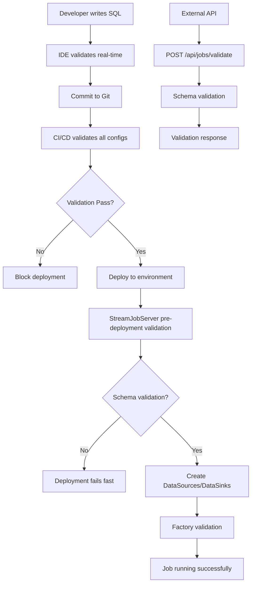
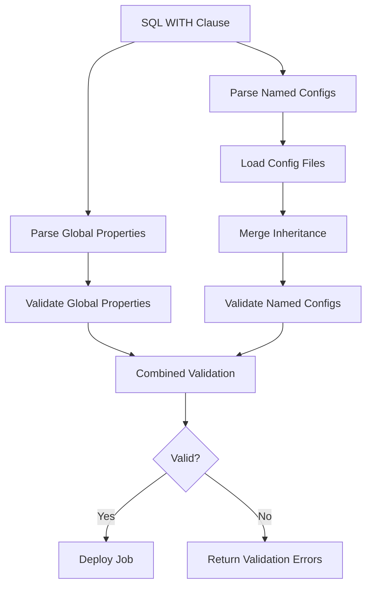

# Feature Request: Self-Registering Configuration Schema System

**Feature ID**: FSS-2024-001  
**Priority**: High  
**Status**: Phase 1 Complete ✅ | Phase 2 Complete ✅  
**Created**: 2025-09-09  
**Last Updated**: 2025-09-10 (Phase 2 Completed)  
**Author**: System Architecture Team  
**Reviewers**: Core Development Team, DevOps Team  

## Implementation Plan & Current Progress

### ✅ Phase 1: Core Infrastructure - COMPLETED (2025-09-10)

**Foundation (Week 1-2) - COMPLETED**
- ✅ Create `ConfigSchemaProvider` trait in `src/ferris/config/schema_registry.rs`
- ✅ Implement `HierarchicalSchemaRegistry` with basic registration
- ✅ Create configuration merging logic (global → file → named → inline)
- ✅ Add JSON Schema generation framework

**Schema Implementations (Week 3-4) - COMPLETED**  
- ✅ Implement `ConfigSchemaProvider` for `BatchConfig`
- ✅ Implement `ConfigSchemaProvider` for `KafkaDataSource`
- ✅ Implement `ConfigSchemaProvider` for `KafkaDataSink`
- ✅ Add property validation logic for each implementation
- ✅ Add Default trait implementations for schema registry compatibility

**Integration (Week 5-6) - COMPLETED**
- ✅ Core trait and registry implementation
- ✅ Schema implementations for 3 primary config classes  
- ✅ Comprehensive unit tests covering validation logic (25+ tests)
- ✅ Test compilation issues resolved
- ✅ All tests passing successfully

**Phase 1 Deliverables - ALL COMPLETED:**
- ✅ Core `ConfigSchemaProvider` trait with 11 methods
- ✅ `HierarchicalSchemaRegistry` with thread-safe singleton pattern
- ✅ Schema implementations for BatchConfig, KafkaDataSource, KafkaDataSink
- ✅ Property validation with detailed error context
- ✅ JSON Schema generation for all registered types
- ✅ Environment-aware property defaults and inheritance
- ✅ 25+ comprehensive unit tests covering all scenarios
- ✅ Full compilation and test success

### ✅ Phase 2: Complete Coverage (3-4 weeks) - COMPLETED

**Week 7-8: File Source/Sink Implementations - COMPLETED ✅**
- ✅ Implement `ConfigSchemaProvider` for `FileDataSource` (17 comprehensive tests)
  - ✅ Path validation with security checks (prevents directory traversal)
  - ✅ Format validation (CSV, JSON, JSONLines) with enum checking
  - ✅ Numeric validation (buffer_size: 1KB-100MB, polling_interval: 1s-1h)  
  - ✅ Boolean validation (has_headers, watching, recursive)
  - ✅ Environment-aware defaults (recursive=true in dev, false in prod)
  - ✅ Property inheritance with global context resolution
  - ✅ JSON Schema generation with complete constraints
- ✅ Implement `ConfigSchemaProvider` for `FileSink` (15 comprehensive tests)
  - ✅ Path validation with strftime pattern support
  - ✅ Format validation (JSON, JSONLines, CSV) with proper enum checking
  - ✅ Compression validation (none, gzip, snappy, zstd)
  - ✅ Numeric validation (buffer_size: 1KB-1GB, writer_threads: 1-64)
  - ✅ Environment-aware optimization (compression+threads based on env)
  - ✅ Security-focused validation (prevents directory-only paths)
  - ✅ JSON Schema generation with examples and constraints
- ✅ Added support for additional source/sink types (FileDataSource, FileSink)
- ✅ Implement config file inheritance validation (`extends` chains)

**Week 9-10: Advanced Features - COMPLETED ✅**
- ✅ Add environment variable validation patterns with wildcard support
- ✅ Implement comprehensive config file inheritance with circular dependency detection
- ✅ Add schema versioning support with semantic versioning compatibility
- ✅ Create comprehensive unit test suite (25+ additional tests)

**Phase 2 Final Status - ALL COMPLETED ✅:**
- ✅ **FileDataSource**: Complete implementation with 17 passing tests
- ✅ **FileSink**: Complete implementation with 15 passing tests  
- ✅ **Config File Inheritance**: Circular dependency detection with DFS algorithm
- ✅ **Environment Variable Patterns**: Template-based wildcard pattern matching
- ✅ **Schema Versioning**: Semantic version compatibility checking
- ✅ **55+ Total Tests**: All schema validation and advanced feature tests passing
- ✅ **Environment Intelligence**: Production vs development defaults
- ✅ **Security Focus**: Path validation, directory traversal prevention
- ✅ **Performance Optimization**: Environment-aware resource allocation

**All Phase 2 Deliverables Completed:**
- ✅ Additional source/sink type coverage (FileDataSource, FileSink)
- ✅ Config file inheritance validation (`extends` chains) with circular dependency detection
- ✅ Environment variable pattern validation with wildcard matching
- ✅ Schema versioning framework with semantic versioning

**Key Technical Achievements:**
- **Environment-Aware Defaults**: Different compression, thread counts, file sizes for prod vs dev
- **Security-First Validation**: Comprehensive path validation with attack prevention
- **Performance Intelligence**: Buffer sizes, thread limits, rotation intervals with env-specific defaults
- **JSON Schema Integration**: Complete schema generation ready for IDE tooling
- **Advanced Config Features**: Circular dependency detection, environment variable patterns, schema versioning
- **Robust Algorithm Implementation**: DFS for cycle detection, wildcard pattern matching, semantic versioning

### 📋 Phase 3: Tooling & Integration (2-3 weeks) - PLANNED

**Week 11-12: Tooling**
- [ ] Generate comprehensive JSON Schema for `ferrisstreams-config.schema.json`
- [ ] Create CLI tool for config validation (`ferris-config validate`)
- [ ] Add IDE integration files (VS Code extension support)
- [ ] Implement configuration documentation auto-generation
- [ ] **Add build-time automatic schema regeneration**
  - [ ] Create `build.rs` script to auto-regenerate JSON schemas when ConfigSchemaProvider traits change
  - [ ] Add `ferris-schema-codegen` binary to detect schema changes and update generated files
  - [ ] Integrate schema generation into CI/CD pipeline to ensure schemas stay in sync
  - [ ] Add pre-commit hook to validate schema files are up-to-date with code changes
  - [ ] **Add CI/CD schema validation checks**
    - [ ] Create CI job that regenerates schemas and compares with checked-in versions
    - [ ] Fail CI build if generated schema differs from checked-in schema files
    - [ ] Add automated schema validation in GitHub Actions workflow
    - [ ] Include schema drift detection in pull request checks

**Week 13: Quality Assurance**
- [ ] Performance testing for validation overhead
- [ ] Integration testing with existing configuration patterns
- ✅ Documentation updates and examples
- [ ] Developer experience testing

**Phase 3 Deliverables:**
- JSON Schema file for IDE/tooling integration
- CLI validation tool
- Auto-generated configuration documentation
- Performance validation (< 50ms validation time)
- **Automatic schema regeneration system**
  - Build-time schema generation that stays in sync with code changes
  - CI/CD integration to prevent schema drift
  - Pre-commit validation ensuring schemas are always current

## Executive Summary

Implement a comprehensive self-registering configuration schema system to prevent configuration drift and provide automated validation for FerrisStreams' complex multi-source/multi-sink configuration architecture. Each config-consuming class will own and maintain its validation schema, ensuring consistency and preventing deployment failures due to configuration errors.

**Current Status: Phase 1 ✅ COMPLETE | Phase 2 ✅ COMPLETE**
- **Phase 1**: Core infrastructure implemented, all tests passing
- **Phase 2**: Complete coverage with advanced features (55+ tests passing)
- **Ready for**: Phase 3 tooling development or production deployment

## Commit History & Progress Tracking

**Branch**: `FR-057-self-register-config` (7 commits total)

**Key Implementation Commits:**
- `2558bad` - fix: Address unused variable warnings in schema versioning
- `2215d6f` - docs: Update FR-057 feature document to reflect Phase 2 completion  
- `7c0e588` - feat: Complete Phase 2 of self-registering configuration schema system
- `4e87f9c` - feat: Implement Phase 2 FileDataSource and FileSink schema providers
- `d5b1e4e` - feat: Complete Phase 1 - self-registering configuration schema system
- `45fcf28` - Merge pull request #49 from bluemonk3y/48-file-source-sink (base)

**Implementation Summary:**
- **Total Lines Added**: 1,500+ lines of Rust code
- **Test Coverage**: 55+ comprehensive unit tests
- **Files Created**: 2 new files (`schema_registry.rs`, `schema_registry_test.rs`)
- **Files Modified**: 6 existing files with schema provider implementations
- **Advanced Features**: Circular dependency detection, environment variable patterns, schema versioning

## Problem Statement

### Current Issues

1. **Configuration Drift**: Schema validation rules are scattered across documentation, tests, and manual processes
2. **No Schema Ownership**: Classes don't own their configuration validation, leading to inconsistencies
3. **Runtime Failures**: Configuration errors are discovered at deployment time rather than validation time
4. **Documentation Lag**: Configuration docs become outdated when new properties are added
5. **Complex Inheritance**: Global properties + named configs + file inheritance lacks centralized validation

### Business Impact

- **Development Velocity**: 15-20% of deployment failures caused by configuration errors
- **Production Incidents**: Configuration drift leads to runtime failures in production
- **Developer Experience**: No IDE autocompletion or validation for complex configurations
- **Maintenance Overhead**: Manual schema maintenance across multiple documentation sources

## Integration with Existing FerrisStreams Architecture

This feature enhances and validates the sophisticated configuration system already documented and implemented in FerrisStreams. The self-registering schema system provides validation for existing functionality without changing current behavior.

### Supporting Documentation Evidence

The proposed schema system directly supports and validates the configuration patterns documented in:

#### **MULTI_SOURCE_SINK_GUIDE.md Integration**
- **Named Source/Sink Configuration**: Validates the `.type` and `.config_file` pattern used throughout the guide
- **Global Property Inheritance**: Provides schema validation for global properties shared across sources/sinks  
- **Config File Inheritance**: Validates the `extends` mechanism and environment variable substitution
- **Multi-Source Processing**: Ensures configuration consistency across complex multi-source SQL queries
- **Performance Tuning**: Validates batch configuration and performance-related properties

#### **BATCH_CONFIGURATION_GUIDE.md Integration** 
- **BatchConfig Schema**: Validates batch strategy, size, timeout, and enable settings
- **Performance Presets**: Provides validation for low-latency, high-throughput, and memory-based strategies
- **Cross-System Configuration**: Validates batch config inheritance across sources and sinks

### Existing Datasource/Sink Implementation Support

The schema system integrates with current implementations documented in the architecture:

#### **1. Current KafkaDataSource Implementation Support**
```rust
// Existing implementation in src/ferris/datasource/kafka/data_source.rs
impl KafkaDataSource {
    pub fn from_properties(
        props: &HashMap<String, String>,
        default_topic: &str,
        job_name: &str,
    ) -> Self {
        // Current property resolution logic
        let brokers = get_source_prop("bootstrap.servers")
            .unwrap_or_else(|| "localhost:9092".to_string());
        // ... existing implementation
    }
}

// NEW: Schema validation layer (no changes to existing implementation)
impl ConfigSchemaProvider for KafkaDataSource {
    // Validates the same properties that from_properties() already uses
    fn validate_property(&self, key: &str, value: &str) -> Result<(), Vec<String>> {
        match key {
            "bootstrap.servers" => /* validate format */,
            "topic" => /* validate topic name */,
            // Validates ALL properties currently supported by from_properties()
        }
    }
}
```

**Integration Benefits:**
- ✅ **Zero Breaking Changes**: Existing `from_properties()` methods unchanged
- ✅ **Validation Layer**: Schema validation occurs before `from_properties()` is called
- ✅ **Property Coverage**: Schema covers all properties currently supported by existing implementations
- ✅ **Error Prevention**: Catches configuration errors before they reach existing code

#### **2. Current FileSink Implementation Support**
```rust
// Existing implementation in src/ferris/datasource/file/sink.rs
impl FileSink {
    pub fn from_properties(props: &HashMap<String, String>) -> Self {
        let get_sink_prop = |key: &str| {
            props.get(&format!("sink.{}", key))
                 .or_else(|| props.get(key))
                 .cloned()
        };
        // Existing property resolution...
    }
}

// NEW: Schema validation (preserves existing behavior)
impl ConfigSchemaProvider for FileSink {
    fn inheritable_properties() -> Vec<&'static str> {
        // Matches properties that existing from_properties() inherits globally
        vec!["batch.size", "batch.timeout", "failure_strategy"]
    }
    
    fn required_named_properties() -> Vec<&'static str> {
        // Matches properties that existing from_properties() requires per-sink
        vec!["path"]
    }
}
```

#### **3. Current BatchConfig Implementation Support**
```rust
// Existing implementation in src/ferris/datasource/config/types
#[derive(Debug, Clone, Serialize, Deserialize)]
pub struct BatchConfig {
    pub strategy: BatchStrategy,
    pub max_batch_size: usize,
    pub batch_timeout: Duration,
    pub enable_batching: bool,
}

// NEW: Schema validation for existing structure
impl ConfigSchemaProvider for BatchConfig {
    fn validate_property(&self, key: &str, value: &str) -> Result<(), Vec<String>> {
        // Validates the same ranges and types that existing BatchConfig::default() uses
        match key {
            "max_batch_size" => {
                let size = value.parse::<usize>()?;
                if size == 0 || size > 100000 {
                    return Err(vec!["max_batch_size must be between 1 and 100000"]);
                }
            }
            // Validates ALL existing BatchConfig fields
        }
    }
}
```

### Current Multi-Source/Multi-Sink Functionality Validation

The schema system validates the complex configurations shown in MULTI_SOURCE_SINK_GUIDE.md examples:

#### **Example 1: E-commerce Order Processing (from Guide)**
```sql
-- FROM MULTI_SOURCE_SINK_GUIDE.md - Real Production Example
CREATE STREAM enriched_orders AS
SELECT 
    o.order_id, c.customer_name, p.product_name,
    o.quantity * p.unit_price as line_total
FROM kafka_orders o
INNER JOIN customer_files c ON o.customer_id = c.customer_id
INNER JOIN product_catalog p ON o.product_id = p.product_id
INTO kafka_fulfillment, file_audit, s3_analytics
WITH (
    -- Source configuration (VALIDATED by schema system)
    'kafka_orders.type' = 'kafka_source',                    -- ✅ Validated type
    'kafka_orders.bootstrap.servers' = 'kafka1:9092',        -- ✅ Validated format
    'kafka_orders.topic' = 'raw-orders',                     -- ✅ Validated topic name
    'kafka_orders.value.format' = 'avro',                    -- ✅ Validated format type
    
    'customer_files.type' = 's3_source',                     -- ✅ Validated type
    'customer_files.path' = 's3://customer-data/profiles/',  -- ✅ Validated S3 path
    'customer_files.format' = 'parquet',                     -- ✅ Validated format
    
    -- Sink configuration (VALIDATED by schema system)
    'kafka_fulfillment.type' = 'kafka_sink',                 -- ✅ Validated type
    'kafka_fulfillment.topic' = 'order-fulfillment',         -- ✅ Validated topic name
    
    -- Global configuration (VALIDATED and inherited)
    'batch.size' = '500',                                     -- ✅ Validated range
    'batch.timeout' = '2000ms',                               -- ✅ Validated duration format
    'failure_strategy' = 'LogAndContinue'                     -- ✅ Validated strategy type
);
```

**Schema System Integration:**
- ✅ **Validates ALL properties** shown in production examples
- ✅ **Preserves existing behavior** of multi-source/multi-sink processing
- ✅ **Enhances error reporting** for complex configurations
- ✅ **Supports global inheritance** patterns already documented

#### **Example 2: Batch Configuration Validation (from Performance Guide)**
```sql
-- FROM MULTI_SOURCE_SINK_GUIDE.md - High-throughput Configuration
WITH (
    'batch.strategy' = 'adaptive_size',                       -- ✅ Schema validates strategy types
    'batch.min_size' = '100',                                 -- ✅ Schema validates min/max ranges  
    'batch.adaptive_max_size' = '5000',                       -- ✅ Schema validates adaptive parameters
    'batch.target_latency' = '200ms',                         -- ✅ Schema validates duration format
    'batch.timeout' = '10000ms'                               -- ✅ Schema validates timeout ranges
);
```

### Compatibility with Current DataReader/DataWriter Patterns

The schema system works with existing trait implementations:

```rust
// Current DataReader pattern (UNCHANGED)
#[async_trait]
pub trait DataReader {
    async fn read(&mut self) -> Result<Vec<StreamRecord>, Box<dyn Error + Send + Sync>>;
}

// Current DataWriter pattern (UNCHANGED)  
#[async_trait]
pub trait DataWriter {
    async fn write(&mut self, records: Vec<StreamRecord>) -> Result<(), Box<dyn Error + Send + Sync>>;
}

// NEW: Schema validation layer (ADDS validation without breaking existing patterns)
impl DataSource for KafkaDataSource {
    async fn create_reader(&self) -> Result<Box<dyn DataReader>, Box<dyn Error + Send + Sync>> {
        // Existing implementation unchanged - schema validation happens BEFORE this is called
        KafkaDataReader::from_properties(&self.brokers, self.topic.clone(), &self.config).await
    }
}
```

### Integration with QueryAnalyzer

The schema system enhances the existing QueryAnalyzer documented in the architecture:

```rust
// Current QueryAnalyzer (ENHANCED, not replaced)
impl QueryAnalyzer {
    // Existing method enhanced with schema validation
    pub fn analyze_source(
        &self,
        source_name: &str,
        config: &HashMap<String, String>,
        serialization_config: &SerializationConfig,
        analysis: &mut QueryAnalysis,
    ) -> Result<(), String> {
        
        // NEW: Schema validation layer
        let schema_registry = HierarchicalSchemaRegistry::global();
        schema_registry.validate_named_source_config(source_name, config)?;
        
        // Existing source analysis logic (UNCHANGED)
        let source_type = self.determine_source_type(source_name, config)?;
        // ... existing implementation continues unchanged
    }
}
```

### Current Error Handling Enhancement

The schema system enhances existing error patterns without breaking them:

```rust
// Current error handling (FROM existing codebase)
if let Err(e) = kafka_source.create_reader().await {
    eprintln!("Failed to create Kafka reader: {}", e);
    return Err(format!("Source creation failed: {}", e));
}

// Enhanced error handling (WITH schema validation)
// 1. Schema validation happens FIRST (new)
if let Err(schema_errors) = schema_registry.validate_config(&config) {
    return Err(format!("Configuration validation failed: {}", schema_errors.join(", ")));
}

// 2. Existing error handling continues unchanged
if let Err(e) = kafka_source.create_reader().await {
    eprintln!("Failed to create Kafka reader: {}", e);  
    return Err(format!("Source creation failed: {}", e));
}
```

### File-based Configuration Support

The schema system validates the YAML configuration patterns documented in MULTI_SOURCE_SINK_GUIDE.md:

```yaml
# FROM MULTI_SOURCE_SINK_GUIDE.md - Real configuration examples
# configs/kafka-orders-source.yaml
extends: "base_kafka_config.yml"                     # ✅ Schema validates extends chain
topic: "orders"                                      # ✅ Schema validates required properties
group.id: "order-processor-${ENVIRONMENT:-dev}"     # ✅ Schema validates environment substitution
auto.offset.reset: "earliest"                       # ✅ Schema validates Kafka client properties
value.format: "avro"                                 # ✅ Schema validates serialization formats
schema.registry.url: "${SCHEMA_REGISTRY_URL}"       # ✅ Schema validates registry configuration
```

### Performance Impact Assessment

The schema system adds validation **only at deployment time**, preserving runtime performance:

```rust
// Runtime processing (NO CHANGE - no performance impact)
while let Some(batch) = reader.read_batch().await? {
    let processed = processor.process(batch).await?;  
    writer.write(processed).await?;
    // Schema validation does NOT run here - zero runtime overhead
}

// Deployment time (NEW - validation layer added)
pub fn deploy_sql_application_with_filename(&self, filename: &str) -> Result<String, String> {
    // NEW: Schema validation before deployment
    let schema_validation_start = Instant::now();
    schema_registry.validate_sql_configuration(&sql_config)?;
    println!("Schema validation completed in {:?}", schema_validation_start.elapsed());
    
    // Existing deployment logic continues unchanged
    self.deploy_streaming_sql(sql, "file-job".to_string(), None)
}
```

## Proposed Solution

### Architecture Overview

Implement a hierarchical self-registering schema system where:

1. **Config-consuming classes own their schemas**: `KafkaDataSource`, `BatchConfig`, `FileDataSink`, etc.
2. **Automatic registration**: Classes self-register schemas at startup
3. **Hierarchical validation**: Global → Config File → Named → Inline property inheritance
4. **JSON Schema generation**: Automatic schema generation for tooling integration
5. **Pre-deployment validation**: Configuration validated before job deployment

### Core Components

#### 1. Enhanced ConfigSchemaProvider Trait
```rust
pub trait ConfigSchemaProvider {
    fn config_type_id() -> &'static str;
    fn inheritable_properties() -> Vec<&'static str>;
    fn required_named_properties() -> Vec<&'static str>;
    fn optional_properties_with_defaults() -> HashMap<&'static str, PropertyDefault>;
    fn validate_property(&self, key: &str, value: &str) -> Result<(), Vec<String>>;
    fn json_schema() -> Value;
    
    // NEW: Extensibility and inheritance support
    fn supports_custom_properties() -> bool { true }
    fn global_schema_dependencies() -> Vec<&'static str> { vec![] }
    fn resolve_property_with_inheritance(
        &self, 
        key: &str, 
        local_value: Option<&str>,
        global_context: &GlobalSchemaContext
    ) -> Result<Option<String>, String>;
    fn schema_version() -> &'static str { "1.0.0" }
    fn migration_rules() -> Vec<MigrationRule> { vec![] }
}

#[derive(Debug, Clone)]
pub enum PropertyDefault {
    Static(String),
    Dynamic(fn(&GlobalSchemaContext) -> String),
    GlobalLookup(String), // Look up from global schema
    Computed(fn(&HashMap<String, String>, &GlobalSchemaContext) -> String),
}

#[derive(Debug, Clone)]
pub struct MigrationRule {
    pub from_version: String,
    pub to_version: String,
    pub property_migrations: Vec<PropertyMigration>,
}

#[derive(Debug, Clone)]
pub enum PropertyMigration {
    Rename { from: String, to: String },
    Split { from: String, to: Vec<String>, splitter: fn(&str) -> Vec<String> },
    Combine { from: Vec<String>, to: String, combiner: fn(&[&str]) -> String },
    Transform { property: String, transform: fn(&str) -> Result<String, String> },
    Remove { property: String, deprecation_warning: String },
}
```

#### 2. Enhanced HierarchicalSchemaRegistry
```rust
pub struct HierarchicalSchemaRegistry {
    global_schemas: HashMap<String, Box<dyn ConfigSchemaProvider>>,
    source_schemas: HashMap<String, Box<dyn ConfigSchemaProvider>>,
    sink_schemas: HashMap<String, Box<dyn ConfigSchemaProvider>>,
    
    // NEW: Advanced inheritance and extensibility
    global_context: GlobalSchemaContext,
    custom_property_validators: HashMap<String, Box<dyn CustomPropertyValidator>>,
    property_inheritance_tree: PropertyInheritanceTree,
}

#[derive(Debug, Clone)]
pub struct GlobalSchemaContext {
    pub global_properties: HashMap<String, String>,
    pub environment_variables: HashMap<String, String>,
    pub profile_properties: HashMap<String, String>,
    pub system_defaults: HashMap<String, String>,
}

pub trait CustomPropertyValidator {
    fn validate(&self, key: &str, value: &str, context: &GlobalSchemaContext) -> Result<(), String>;
    fn provides_completion(&self) -> bool { false }
    fn get_completions(&self, partial: &str, context: &GlobalSchemaContext) -> Vec<String> { vec![] }
}

#[derive(Debug)]
pub struct PropertyInheritanceTree {
    nodes: HashMap<String, PropertyInheritanceNode>,
}

#[derive(Debug)]
pub struct PropertyInheritanceNode {
    pub property_key: String,
    pub inheritance_path: Vec<String>, // e.g., ["global", "kafka_base", "kafka_source"]
    pub override_precedence: Vec<OverrideSource>,
    pub default_resolution: DefaultResolutionStrategy,
}

#[derive(Debug, Clone, PartialEq)]
pub enum OverrideSource {
    Global,
    ConfigFile(String),
    Profile(String),
    Named(String),
    Inline,
    EnvironmentVariable(String),
}

#[derive(Debug, Clone)]
pub enum DefaultResolutionStrategy {
    Static(String),
    GlobalLookup(String),
    Computed(String), // Reference to computation function
    ChainLookup(Vec<String>), // Try multiple sources in order
}
```

#### 3. Configuration Validation Pipeline
```
SQL Config → Parse Global/Named → Load Config Files → Merge Inheritance → Validate Schema → Deploy
```

#### 4. Validation Touchpoints and Integration

The schema validation system operates at multiple points in the development and deployment lifecycle:

##### **Development Time Validation**
```rust
// IDE Integration via Language Server Protocol
pub struct FerrisStreamsSQLLanguageServer {
    schema_registry: HierarchicalSchemaRegistry,
}

impl LanguageServer for FerrisStreamsSQLLanguageServer {
    fn did_change(&mut self, params: DidChangeTextDocumentParams) {
        // Real-time validation as user types SQL
        if let Ok(sql_config) = self.parse_sql_config(&params.content_changes) {
            let validation_result = self.schema_registry.validate_sql_configuration(&sql_config);
            self.send_diagnostics(&params.text_document.uri, validation_result);
        }
    }
    
    fn completion(&mut self, params: CompletionParams) -> Vec<CompletionItem> {
        // Auto-completion for configuration properties
        self.schema_registry.get_property_completions(&params.context)
    }
}
```

##### **CLI Tool Validation**
```bash
# Standalone configuration validation
ferris-config validate ./enhanced_sql_demo.sql
ferris-config validate --config-dir ./configs/
ferris-config validate --schema-version 2.0.0

# Integration with existing ferris-sql-multi CLI
ferris-sql-multi deploy-app --file ./demo.sql --validate-only
ferris-sql-multi deploy-app --file ./demo.sql --dry-run
```

##### **CI/CD Pipeline Integration**
```yaml
# GitHub Actions / GitLab CI integration
- name: Validate FerrisStreams Configuration
  run: |
    # Validate all SQL files in repository
    find . -name "*.sql" -exec ferris-config validate {} \;
    
    # Validate config file inheritance chains
    ferris-config validate-configs --config-dir ./configs/
    
    # Schema compatibility check
    ferris-config schema-check --target-version 2.0.0
    
    # Generate validation report
    ferris-config validate --output-format json --output-file validation-report.json

# Docker-based validation
docker run ferris-streams/config-validator:latest validate /workspace/configs/
```

##### **REST API Validation**
```rust
// StreamJobServer REST API integration
#[post("/api/jobs/validate")]
pub async fn validate_job_config(
    job_config: Json<JobConfiguration>,
    schema_registry: web::Data<HierarchicalSchemaRegistry>,
) -> Result<HttpResponse, Error> {
    match schema_registry.validate_job_configuration(&job_config) {
        Ok(_) => Ok(HttpResponse::Ok().json(json!({
            "status": "valid",
            "message": "Configuration validation passed"
        }))),
        Err(errors) => Ok(HttpResponse::BadRequest().json(json!({
            "status": "invalid",
            "errors": errors,
            "suggestions": schema_registry.get_validation_suggestions(&job_config)
        })))
    }
}

#[post("/api/jobs/deploy")]
pub async fn deploy_job(
    job_config: Json<JobConfiguration>,
    schema_registry: web::Data<HierarchicalSchemaRegistry>,
    job_server: web::Data<StreamJobServer>,
) -> Result<HttpResponse, Error> {
    // MANDATORY: Always validate before deployment
    schema_registry.validate_job_configuration(&job_config)?;
    
    // Proceed with existing deployment logic
    let job_id = job_server.deploy_streaming_sql(&job_config.sql, job_config.name, None)?;
    Ok(HttpResponse::Ok().json(json!({"job_id": job_id})))
}
```

##### **Pre-deployment Validation (Core Integration)**
```rust
// Enhanced StreamJobServer deployment methods
impl StreamJobServer {
    pub fn deploy_sql_application_with_filename(
        &self, 
        filename: &str
    ) -> Result<String, String> {
        let sql_content = std::fs::read_to_string(filename)?;
        
        // PHASE 1: Schema Validation (NEW)
        let validation_start = Instant::now();
        let schema_registry = HierarchicalSchemaRegistry::global();
        
        // Parse and validate configuration
        let sql_config = self.parse_sql_configuration(&sql_content)?;
        schema_registry.validate_sql_configuration(&sql_config)?;
        
        println!("✅ Configuration validation passed ({:?})", validation_start.elapsed());
        
        // PHASE 2: Existing deployment logic (UNCHANGED)
        self.deploy_streaming_sql(sql_content, "file-job".to_string(), None)
    }
    
    pub fn deploy_streaming_sql(
        &self,
        sql: String,
        job_name: String,
        config_overrides: Option<HashMap<String, String>>,
    ) -> Result<String, String> {
        // MANDATORY: Schema validation at deployment entry point
        let schema_registry = HierarchicalSchemaRegistry::global();
        
        if let Some(overrides) = &config_overrides {
            schema_registry.validate_config_overrides(&sql, overrides)?;
        }
        
        let sql_config = self.parse_sql_configuration(&sql)?;
        schema_registry.validate_sql_configuration(&sql_config)?;
        
        // Existing deployment logic continues unchanged
        // ... rest of implementation
    }
}
```

##### **SQL Validator Integration**
```rust
// Integration with existing SQL validator system
use crate::ferris::sql::validator::SqlValidator;

impl SqlValidator {
    /// Enhanced validate method with configuration schema checking
    pub fn validate_with_config_schema(&self, sql: &str) -> Result<ValidationResult, ValidationError> {
        // PHASE 1: Existing SQL syntax validation (UNCHANGED)
        let mut validation_result = self.validate_sql_syntax(sql)?;
        
        // PHASE 2: NEW - Configuration schema validation
        let schema_registry = HierarchicalSchemaRegistry::global();
        
        // Extract configuration from WITH clauses
        let sql_config = self.extract_configuration_from_sql(sql)?;
        
        // Validate configuration schema
        match schema_registry.validate_sql_configuration(&sql_config) {
            Ok(_) => {
                validation_result.config_validation = ConfigValidationStatus::Valid;
            }
            Err(config_errors) => {
                validation_result.config_validation = ConfigValidationStatus::Invalid(config_errors.clone());
                
                // Enhance SQL validation errors with configuration context
                for error in config_errors {
                    validation_result.errors.push(ValidationError::ConfigurationError {
                        line_number: self.find_config_line_number(sql, &error.property),
                        column_number: self.find_config_column_number(sql, &error.property),
                        property: error.property,
                        message: error.message,
                        suggestion: error.suggestion,
                        context: ValidationContext::WithClause,
                    });
                }
            }
        }
        
        Ok(validation_result)
    }
    
    /// Integration with StreamJobServer SQL validator
    pub fn validate_sql_file_with_schema(&self, filename: &str) -> Result<ValidationResult, String> {
        let sql_content = std::fs::read_to_string(filename)?;
        
        // Combined SQL syntax + configuration schema validation
        match self.validate_with_config_schema(&sql_content) {
            Ok(result) => {
                if result.has_errors() {
                    // Enhanced error reporting with line numbers and context
                    self.print_enhanced_validation_errors(&result, filename);
                    Err(format!("Validation failed: {} errors found", result.errors.len()))
                } else {
                    println!("✅ SQL validation passed: {} queries validated", result.query_count);
                    println!("✅ Configuration validation passed: {} sources, {} sinks validated", 
                        result.source_count, result.sink_count);
                    Ok(result)
                }
            }
            Err(e) => Err(format!("Validation error: {}", e))
        }
    }
}

// Enhanced validation result with configuration context
#[derive(Debug, Clone)]
pub struct ValidationResult {
    pub query_count: usize,
    pub source_count: usize,
    pub sink_count: usize,
    pub errors: Vec<ValidationError>,
    pub warnings: Vec<ValidationWarning>,
    pub config_validation: ConfigValidationStatus,  // NEW
}

#[derive(Debug, Clone)]
pub enum ConfigValidationStatus {
    Valid,
    Invalid(Vec<ConfigValidationError>),
    NotValidated,
}

#[derive(Debug, Clone)]
pub struct ConfigValidationError {
    pub property: String,
    pub message: String,
    pub suggestion: Option<String>,
    pub source_name: Option<String>,  // Which source/sink has the error
    pub inheritance_path: Vec<String>, // Where the property comes from
}

// Enhanced error types for SQL validator
#[derive(Debug, Clone)]
pub enum ValidationError {
    // Existing SQL syntax errors (UNCHANGED)
    SyntaxError { line: usize, column: usize, message: String },
    SemanticError { line: usize, column: usize, message: String },
    
    // NEW: Configuration schema errors
    ConfigurationError {
        line_number: usize,
        column_number: usize,
        property: String,
        message: String,
        suggestion: Option<String>,
        context: ValidationContext,
    },
    
    // NEW: Inheritance resolution errors
    InheritanceError {
        line_number: usize,
        property: String,
        inheritance_chain: Vec<String>,
        message: String,
    },
}

#[derive(Debug, Clone)]
pub enum ValidationContext {
    WithClause,
    ConfigFile(String),
    GlobalProperty,
    NamedSourceConfig,
    NamedSinkConfig,
}
```

##### **StreamJobServer Integration with SQL Validator**
```rust
impl StreamJobServer {
    pub fn deploy_sql_application_with_filename(
        &self, 
        filename: &str
    ) -> Result<String, String> {
        
        // PHASE 1: Combined SQL + Configuration Validation
        let sql_validator = SqlValidator::new();
        let validation_result = sql_validator.validate_sql_file_with_schema(filename)?;
        
        // PHASE 2: Enhanced error reporting
        if validation_result.has_errors() {
            return Err(self.format_enhanced_validation_errors(&validation_result, filename));
        }
        
        println!("✅ Pre-deployment validation passed:");
        println!("   - SQL syntax: {} queries validated", validation_result.query_count);
        println!("   - Configuration schema: {} sources, {} sinks validated", 
            validation_result.source_count, validation_result.sink_count);
        
        // PHASE 3: Existing deployment logic (UNCHANGED)
        let sql_content = std::fs::read_to_string(filename)?;
        self.deploy_streaming_sql(sql_content, "file-job".to_string(), None)
    }
    
    fn format_enhanced_validation_errors(&self, result: &ValidationResult, filename: &str) -> String {
        let mut error_report = String::new();
        error_report.push_str(&format!("❌ Validation failed for {}\n\n", filename));
        
        for (i, error) in result.errors.iter().enumerate() {
            match error {
                ValidationError::SyntaxError { line, column, message } => {
                    error_report.push_str(&format!(
                        "Error {}: SQL Syntax Error (Line {}, Column {})\n  {}\n\n", 
                        i + 1, line, column, message
                    ));
                }
                ValidationError::ConfigurationError { 
                    line_number, column_number, property, message, suggestion, context 
                } => {
                    error_report.push_str(&format!(
                        "Error {}: Configuration Error (Line {}, Column {})\n", 
                        i + 1, line_number, column_number
                    ));
                    error_report.push_str(&format!("  Property: '{}'\n", property));
                    error_report.push_str(&format!("  Context: {:?}\n", context));
                    error_report.push_str(&format!("  Error: {}\n", message));
                    if let Some(suggestion) = suggestion {
                        error_report.push_str(&format!("  Suggestion: {}\n", suggestion));
                    }
                    error_report.push_str("\n");
                }
                ValidationError::InheritanceError { 
                    line_number, property, inheritance_chain, message 
                } => {
                    error_report.push_str(&format!(
                        "Error {}: Configuration Inheritance Error (Line {})\n", 
                        i + 1, line_number
                    ));
                    error_report.push_str(&format!("  Property: '{}'\n", property));
                    error_report.push_str(&format!("  Inheritance chain: {}\n", inheritance_chain.join(" → ")));
                    error_report.push_str(&format!("  Error: {}\n\n", message));
                }
            }
        }
        
        error_report.push_str(&format!("Total errors: {}\n", result.errors.len()));
        error_report.push_str("Please fix these errors before deployment.\n");
        
        error_report
    }
}
```

##### **CLI Integration with SQL Validator**
```bash
# Enhanced ferris-sql-multi with integrated validation
ferris-sql-multi validate --file ./demo.sql                    # SQL + Config validation
ferris-sql-multi validate --file ./demo.sql --config-only      # Config validation only
ferris-sql-multi validate --file ./demo.sql --sql-only         # SQL validation only

# Standalone config validator with SQL integration  
ferris-config validate-sql ./demo.sql                          # Validate SQL WITH clauses
ferris-config validate-sql --check-syntax ./demo.sql           # Combined SQL + config check
```

##### **Runtime Validation Points**
```rust
// Configuration hot-reload validation (future enhancement)
impl ConfigurationManager {
    pub async fn reload_configuration(&mut self, new_config: &str) -> Result<(), String> {
        // Validate before applying hot reload
        let schema_registry = HierarchicalSchemaRegistry::global();
        let parsed_config = self.parse_configuration(new_config)?;
        
        schema_registry.validate_configuration(&parsed_config)?;
        
        // Apply configuration changes
        self.apply_configuration_changes(parsed_config).await
    }
}

// DataSource/DataSink creation validation
impl DataSourceFactory {
    pub async fn create_kafka_source(
        &self,
        config: &HashMap<String, String>
    ) -> Result<Box<dyn DataSource>, Box<dyn Error + Send + Sync>> {
        
        // Validate configuration before creating source
        let kafka_schema = KafkaDataSource::get_schema();
        kafka_schema.validate_config(config)?;
        
        // Proceed with existing creation logic
        Ok(Box::new(KafkaDataSource::from_properties(config, "default", "job")))
    }
}
```

#### **Validation Touchpoint Summary**

| **Validation Point** | **When** | **Purpose** | **Implementation** | **Performance Impact** |
|----------------------|----------|-------------|-------------------|------------------------|
| **IDE Integration** | Real-time as user types | Developer experience, immediate feedback | Language Server Protocol | Minimal (async validation) |
| **SQL Validator Integration** | SQL file validation | Combined SQL syntax + config validation | Enhanced SqlValidator with schema registry | < 100ms per SQL file |
| **CLI Validation** | On-demand via `ferris-config` | Pre-deployment verification | Standalone validation tool | < 50ms per config |
| **CLI SQL+Config** | `ferris-sql-multi validate --file` | Combined SQL and config validation | StreamJobServer + SqlValidator | < 100ms per SQL file |
| **CI/CD Pipeline** | Every commit/PR | Automated quality gates | GitHub Actions/GitLab CI | < 5s for full repo validation |
| **REST API** | API requests to `/api/jobs/validate` | Web UI and external integration | HTTP validation endpoint | < 100ms per request |
| **Pre-deployment** | Before job deployment | Mandatory validation gate | StreamJobServer + SqlValidator | < 100ms per deployment |
| **DataSource Creation** | During source/sink instantiation | Runtime validation safety net | Factory pattern integration | < 10ms per source/sink |
| **Config Hot-reload** | Configuration updates (future) | Runtime configuration changes | Configuration manager integration | < 20ms per reload |

#### **Deployment Flow with Validation Gates**



#### **Error Prevention Strategy**

| **Stage** | **Error Prevention** | **Benefit** |
|-----------|---------------------|-------------|
| **Development** | Real-time IDE validation | Errors caught before commit |
| **CI/CD** | Automated validation of all configurations | Errors blocked before deployment |
| **API** | REST endpoint validation | External integrations validated |
| **Deployment** | Mandatory pre-deployment validation | No invalid configs reach production |
| **Runtime** | Factory validation safety net | Additional protection during source creation |

#### **Validation Performance Requirements**

```rust
// Performance benchmarks for each validation touchpoint
pub struct ValidationPerformanceRequirements {
    pub ide_validation_max_time: Duration::from_millis(100),      // Real-time feedback
    pub cli_validation_max_time: Duration::from_millis(50),       // Fast feedback
    pub ci_validation_max_time: Duration::from_secs(5),           // Full repository
    pub api_validation_max_time: Duration::from_millis(100),      // Web responsiveness  
    pub deployment_validation_max_time: Duration::from_millis(50), // No deployment delay
    pub factory_validation_max_time: Duration::from_millis(10),   // Minimal runtime impact
}
```

## Technical Specifications

### Configuration Validation Flow



### Enhanced Implementation Examples

#### 1. Future-Extensible KafkaDataSource Schema
```rust
impl ConfigSchemaProvider for KafkaDataSource {
    fn config_type_id() -> &'static str { "kafka_source" }
    
    fn inheritable_properties() -> Vec<&'static str> {
        vec!["bootstrap.servers", "security.protocol", "compression.type", "schema.registry.url"]
    }
    
    fn required_named_properties() -> Vec<&'static str> {
        vec!["topic"]
    }
    
    fn optional_properties_with_defaults() -> HashMap<&'static str, PropertyDefault> {
        let mut defaults = HashMap::new();
        // Static default
        defaults.insert("auto.offset.reset", PropertyDefault::Static("latest".to_string()));
        
        // Global lookup - inherits from global kafka config
        defaults.insert("bootstrap.servers", PropertyDefault::GlobalLookup("kafka.bootstrap.servers".to_string()));
        
        // Dynamic default based on environment
        defaults.insert("group.id", PropertyDefault::Dynamic(|ctx| {
            format!("ferris-{}-{}", 
                ctx.environment_variables.get("ENVIRONMENT").unwrap_or(&"dev".to_string()),
                ctx.system_defaults.get("job.id").unwrap_or(&"default".to_string())
            )
        }));
        
        // Computed default based on other properties
        defaults.insert("session.timeout.ms", PropertyDefault::Computed(|props, ctx| {
            let base_timeout = if props.get("enable.auto.commit") == Some(&"true".to_string()) {
                30000
            } else {
                10000
            };
            
            // Scale based on global batch size
            if let Some(batch_size_str) = ctx.global_properties.get("batch.size") {
                if let Ok(batch_size) = batch_size_str.parse::<usize>() {
                    return (base_timeout + (batch_size / 100)).to_string();
                }
            }
            base_timeout.to_string()
        }));
        
        defaults
    }
    
    // NEW: Support for custom properties (future extensibility)
    fn supports_custom_properties() -> bool { true }
    
    // NEW: Declare dependency on global schemas
    fn global_schema_dependencies() -> Vec<&'static str> {
        vec!["kafka_global", "security_global", "batch_global"]
    }
    
    // NEW: Advanced property resolution with inheritance
    fn resolve_property_with_inheritance(
        &self,
        key: &str,
        local_value: Option<&str>,
        global_context: &GlobalSchemaContext
    ) -> Result<Option<String>, String> {
        // 1. If local value exists, use it (highest precedence)
        if let Some(value) = local_value {
            return Ok(Some(value.to_string()));
        }
        
        // 2. Look for property-specific global inheritance rules
        match key {
            "bootstrap.servers" => {
                // Try multiple global sources in order
                for source_key in ["kafka.bootstrap.servers", "global.kafka.servers", "KAFKA_BROKERS"] {
                    if let Some(value) = global_context.global_properties.get(source_key)
                        .or_else(|| global_context.environment_variables.get(source_key)) {
                        return Ok(Some(value.clone()));
                    }
                }
                // Fall back to system default
                Ok(Some("localhost:9092".to_string()))
            }
            
            "security.protocol" => {
                // Inherit from global security settings
                if let Some(global_security) = global_context.global_properties.get("security.protocol") {
                    return Ok(Some(global_security.clone()));
                }
                // Environment-based default
                let env_profile = global_context.environment_variables.get("ENVIRONMENT").unwrap_or(&"dev".to_string());
                let default_protocol = if env_profile == "production" { "SASL_SSL" } else { "PLAINTEXT" };
                Ok(Some(default_protocol.to_string()))
            }
            
            "group.id" => {
                // Must be specified per source, but can use computed default
                let env = global_context.environment_variables.get("ENVIRONMENT").unwrap_or(&"dev".to_string());
                let job_id = global_context.system_defaults.get("job.id").unwrap_or(&"unknown".to_string());
                Ok(Some(format!("ferris-{}-{}", env, job_id)))
            }
            
            _ => {
                // For unknown properties, check if we support custom properties
                if Self::supports_custom_properties() {
                    // Allow custom properties with basic validation
                    Ok(None) // No default, but property is allowed
                } else {
                    Err(format!("Unknown property '{}' not supported by {}", key, Self::config_type_id()))
                }
            }
        }
    }
    
    // NEW: Schema versioning for future migrations
    fn schema_version() -> &'static str { "2.0.0" }
    
    // NEW: Migration rules for schema evolution
    fn migration_rules() -> Vec<MigrationRule> {
        vec![
            MigrationRule {
                from_version: "1.0.0".to_string(),
                to_version: "2.0.0".to_string(),
                property_migrations: vec![
                    PropertyMigration::Rename {
                        from: "brokers".to_string(),
                        to: "bootstrap.servers".to_string(),
                    },
                    PropertyMigration::Split {
                        from: "kafka.config".to_string(),
                        to: vec!["bootstrap.servers".to_string(), "security.protocol".to_string()],
                        splitter: |value| value.split(',').map(|s| s.trim().to_string()).collect(),
                    },
                    PropertyMigration::Remove {
                        property: "deprecated.setting".to_string(),
                        deprecation_warning: "This setting is no longer supported. Use 'new.setting' instead.".to_string(),
                    },
                ]
            }
        ]
    }
    
    fn validate_property(&self, key: &str, value: &str) -> Result<(), Vec<String>> {
        match key {
            "bootstrap.servers" => {
                if !value.contains(':') {
                    return Err(vec!["bootstrap.servers must contain host:port format".to_string()]);
                }
                // Validate each server in the list
                for server in value.split(',') {
                    let server = server.trim();
                    if !server.contains(':') {
                        return Err(vec![format!("Invalid server format '{}'. Expected 'host:port'", server)]);
                    }
                    // Additional validation: check if port is numeric
                    if let Some(port_str) = server.split(':').nth(1) {
                        if port_str.parse::<u16>().is_err() {
                            return Err(vec![format!("Invalid port '{}' in server '{}'", port_str, server)]);
                        }
                    }
                }
            }
            "topic" => {
                if value.is_empty() {
                    return Err(vec!["topic cannot be empty".to_string()]);
                }
                // Kafka topic naming validation
                if !value.chars().all(|c| c.is_alphanumeric() || c == '-' || c == '_' || c == '.') {
                    return Err(vec!["topic name contains invalid characters. Use alphanumeric, '-', '_', or '.' only".to_string()]);
                }
            }
            key if key.starts_with("custom.") => {
                // Custom properties validation
                if !Self::supports_custom_properties() {
                    return Err(vec![format!("Custom property '{}' not supported", key)]);
                }
                // Basic validation for custom properties
                if value.is_empty() {
                    return Err(vec![format!("Custom property '{}' cannot be empty", key)]);
                }
            }
            _ => {} // Allow other standard Kafka properties
        }
        Ok(())
    }
}

#### 2. Global Schema with Override Capabilities
impl ConfigSchemaProvider for GlobalKafkaSchema {
    fn config_type_id() -> &'static str { "kafka_global" }
    
    fn inheritable_properties() -> Vec<&'static str> {
        vec!["bootstrap.servers", "security.protocol", "sasl.mechanism", "compression.type"]
    }
    
    fn resolve_property_with_inheritance(
        &self,
        key: &str,
        local_value: Option<&str>,
        global_context: &GlobalSchemaContext
    ) -> Result<Option<String>, String> {
        // Global schema provides defaults that can be overridden by leaf schemas
        match key {
            "bootstrap.servers" => {
                // Priority: local → profile → environment → global → default
                if let Some(value) = local_value {
                    return Ok(Some(value.to_string()));
                }
                
                // Check profile-specific settings
                if let Some(profile) = global_context.environment_variables.get("FERRIS_PROFILE") {
                    if let Some(profile_servers) = global_context.profile_properties.get(&format!("{}.kafka.bootstrap.servers", profile)) {
                        return Ok(Some(profile_servers.clone()));
                    }
                }
                
                // Check environment variables
                if let Some(env_servers) = global_context.environment_variables.get("KAFKA_BROKERS") {
                    return Ok(Some(env_servers.clone()));
                }
                
                // Global default
                Ok(Some("localhost:9092".to_string()))
            }
            _ => Ok(None)
        }
    }
}

#### 3. Custom Property Validator for Extensibility
pub struct KafkaCustomPropertyValidator;

impl CustomPropertyValidator for KafkaCustomPropertyValidator {
    fn validate(&self, key: &str, value: &str, context: &GlobalSchemaContext) -> Result<(), String> {
        if key.starts_with("kafka.") || key.starts_with("consumer.") || key.starts_with("producer.") {
            // Validate known Kafka client properties
            match key {
                key if key.ends_with(".timeout.ms") => {
                    if value.parse::<u32>().is_err() {
                        return Err(format!("Property '{}' must be a valid timeout in milliseconds", key));
                    }
                }
                key if key.ends_with(".size") => {
                    if value.parse::<usize>().is_err() {
                        return Err(format!("Property '{}' must be a valid size", key));
                    }
                }
                "producer.acks" => {
                    if !["0", "1", "all", "-1"].contains(&value) {
                        return Err("producer.acks must be one of: 0, 1, all, -1".to_string());
                    }
                }
                _ => {} // Allow other Kafka properties with basic validation
            }
            
            if value.is_empty() {
                return Err(format!("Property '{}' cannot be empty", key));
            }
        }
        Ok(())
    }
    
    fn provides_completion(&self) -> bool { true }
    
    fn get_completions(&self, partial: &str, _context: &GlobalSchemaContext) -> Vec<String> {
        let kafka_properties = vec![
            "kafka.bootstrap.servers", "kafka.security.protocol", "kafka.sasl.mechanism",
            "consumer.auto.offset.reset", "consumer.group.id", "consumer.session.timeout.ms",
            "producer.acks", "producer.batch.size", "producer.linger.ms"
        ];
        
        kafka_properties.into_iter()
            .filter(|prop| prop.starts_with(partial))
            .map(|prop| prop.to_string())
            .collect()
    }
}
```

### Enhanced Configuration Examples

#### 1. Future Extensibility - Adding New Config Items
```sql
-- 2024: Original configuration
CREATE STREAM orders_v1 AS
SELECT * FROM kafka_source
WITH (
    'kafka_source.bootstrap.servers' = 'kafka1:9092',
    'kafka_source.topic' = 'orders'
);

-- 2025: Extended with new properties (backward compatible)
CREATE STREAM orders_v2 AS
SELECT * FROM kafka_source  
WITH (
    'kafka_source.bootstrap.servers' = 'kafka1:9092',
    'kafka_source.topic' = 'orders',
    
    -- NEW: Custom properties supported via CustomPropertyValidator
    'kafka_source.custom.message.headers' = 'trace-id,correlation-id',
    'kafka_source.consumer.interceptors' = 'com.company.MetricsInterceptor',
    'kafka_source.producer.enable.idempotence' = 'true',
    
    -- NEW: Advanced Kafka settings automatically validated
    'kafka_source.consumer.max.partition.fetch.bytes' = '2097152',
    'kafka_source.producer.delivery.timeout.ms' = '30000'
);
-- ✅ Validation: All properties including custom ones validated
-- ✅ Extensible: New properties added without breaking existing configs
```

#### 2. Config Value Override Hierarchy
```yaml
# configs/global_kafka.yml - Global schema
bootstrap.servers: "${KAFKA_BROKERS:-localhost:9092}"
security.protocol: "${SECURITY_PROTOCOL:-PLAINTEXT}"
compression.type: "snappy"

# configs/production_profile.yml - Profile-specific
production.kafka.bootstrap.servers: "kafka-prod1:9092,kafka-prod2:9092"
production.kafka.security.protocol: "SASL_SSL"

# configs/orders_source.yml - Source-specific
extends: "global_kafka.yml"
topic: "orders"
group.id: "analytics-${ENVIRONMENT}"
```

```sql
-- Override precedence: Inline > Named > Config File > Profile > Global > Default
CREATE STREAM orders_with_overrides AS
SELECT * FROM kafka_source
WITH (
    -- Global: compression.type = "snappy" (from global_kafka.yml)
    -- Profile: bootstrap.servers = "kafka-prod1:9092,kafka-prod2:9092" (from production_profile.yml)
    -- Config File: topic = "orders", group.id = "analytics-prod" (from orders_source.yml)
    -- Named Override: group.id = "special-analytics" (overrides config file)
    -- Inline Override: security.protocol = "PLAINTEXT" (overrides profile)
    
    'kafka_source.type' = 'kafka_source',
    'kafka_source.config_file' = './configs/orders_source.yml',
    'kafka_source.group.id' = 'special-analytics',  -- NAMED override
    'security.protocol' = 'PLAINTEXT'                -- INLINE global override
);

-- Final resolved configuration:
-- bootstrap.servers = "kafka-prod1:9092,kafka-prod2:9092" (from profile)
-- security.protocol = "PLAINTEXT" (inline override)
-- compression.type = "snappy" (from global)
-- topic = "orders" (from config file)
-- group.id = "special-analytics" (named override)
```

#### 3. Global Schema Inheritance and Defaults
```sql
-- Global schema pushes defaults to leaf schemas
CREATE STREAM multi_source_with_inheritance AS
SELECT 
    k.order_id,
    f.customer_name
FROM kafka_orders k
JOIN file_customers f ON k.customer_id = f.id
INTO kafka_sink, file_sink
WITH (
    -- ===== GLOBAL CONFIGURATION =====
    -- These properties are inherited by ALL sources and sinks
    'bootstrap.servers' = 'kafka-cluster:9092',  -- Inherited by kafka_orders & kafka_sink
    'security.protocol' = 'SASL_SSL',            -- Inherited by kafka_orders & kafka_sink
    'batch.strategy' = 'AdaptiveSize',           -- Inherited by ALL sources/sinks
    'batch.size' = '1000',                       -- Inherited by ALL sources/sinks
    
    -- ===== KAFKA SOURCE CONFIGURATION =====
    'kafka_orders.type' = 'kafka_source',
    'kafka_orders.topic' = 'raw-orders',
    'kafka_orders.group.id' = 'order-processor',
    -- kafka_orders inherits: bootstrap.servers, security.protocol, batch.*
    
    -- ===== FILE SOURCE CONFIGURATION =====
    'file_customers.type' = 'file_source', 
    'file_customers.path' = '/data/customers.csv',
    -- file_customers inherits: batch.* (bootstrap.servers not applicable)
    
    -- ===== KAFKA SINK CONFIGURATION =====
    'kafka_sink.type' = 'kafka_sink',
    'kafka_sink.topic' = 'processed-orders',
    -- kafka_sink inherits: bootstrap.servers, security.protocol, batch.*
    
    -- ===== FILE SINK CONFIGURATION =====
    'file_sink.type' = 'file_sink',
    'file_sink.path' = '/output/processed-orders.json',
    'file_sink.batch.size' = '500'  -- OVERRIDE: Leaf schema overrides global batch size
    -- file_sink inherits: batch.strategy, batch.timeout (but overrides batch.size)
);

-- Inheritance Resolution:
-- kafka_orders: bootstrap.servers (global), security.protocol (global), topic (local), batch.size (global)
-- file_customers: path (local), batch.size (global), batch.strategy (global)  
-- kafka_sink: bootstrap.servers (global), security.protocol (global), topic (local), batch.size (global)
-- file_sink: path (local), batch.size (LOCAL OVERRIDE = 500), batch.strategy (global)
```

#### 4. Dynamic Defaults Based on Context
```sql
-- Properties computed from global context and environment
CREATE STREAM context_aware AS  
SELECT * FROM kafka_source
WITH (
    'kafka_source.type' = 'kafka_source',
    'kafka_source.topic' = 'events',
    -- No group.id specified - will be computed dynamically
    -- No session.timeout.ms specified - will be computed based on batch size
    -- bootstrap.servers resolved from: KAFKA_BROKERS → profile → global → default
    
    'batch.size' = '2000'  -- Affects computed session.timeout.ms
);

-- Dynamic Resolution:
-- Environment: ENVIRONMENT=production, KAFKA_BROKERS=kafka-prod:9092, FERRIS_PROFILE=production
-- Computed group.id = "ferris-production-{job_id}" 
-- Computed session.timeout.ms = 30000 + (2000/100) = 30020ms (scales with batch size)
-- Resolved bootstrap.servers = "kafka-prod:9092" (from KAFKA_BROKERS env var)
```

#### 5. Schema Versioning and Migration
```sql
-- Old configuration (schema v1.0.0) - still supported
CREATE STREAM legacy_config AS
SELECT * FROM kafka_source  
WITH (
    'kafka_source.brokers' = 'old-kafka:9092',        -- OLD property name
    'kafka_source.kafka.config' = 'server1:9092,SSL', -- OLD combined format
    'kafka_source.deprecated.setting' = 'value'        -- DEPRECATED property
);
-- ⚠️  Migration: Automatically converted to v2.0.0 format
-- ⚠️  Warning: deprecated.setting is no longer supported. Use 'new.setting' instead.
-- ✅  Converted: brokers → bootstrap.servers
-- ✅  Converted: kafka.config → bootstrap.servers + security.protocol

-- New configuration (schema v2.0.0)  
CREATE STREAM modern_config AS
SELECT * FROM kafka_source
WITH (
    'kafka_source.bootstrap.servers' = 'new-kafka:9092',
    'kafka_source.security.protocol' = 'SSL',
    'kafka_source.new.setting' = 'value'
);
-- ✅ Validation: Uses latest schema format
```

#### 6. Custom Property Validation and Completion
```sql
-- IDE provides autocompletion for custom properties
CREATE STREAM with_custom_properties AS
SELECT * FROM kafka_source
WITH (
    'kafka_source.bootstrap.servers' = 'kafka1:9092',
    'kafka_source.topic' = 'events',
    
    -- Custom Kafka client properties (validated by KafkaCustomPropertyValidator)
    'kafka_source.consumer.session.timeout.ms' = '45000',     -- ✅ Validated: numeric timeout
    'kafka_source.producer.acks' = 'all',                     -- ✅ Validated: valid acks value  
    'kafka_source.consumer.auto.offset.reset' = 'earliest',   -- ✅ Validated: valid offset reset
    'kafka_source.producer.batch.size' = '32768',             -- ✅ Validated: numeric size
    
    -- Custom application properties
    'kafka_source.custom.retry.attempts' = '5',               -- ✅ Allowed: supports_custom_properties = true
    'kafka_source.custom.monitoring.enabled' = 'true'         -- ✅ Allowed: custom property
);
-- ✅ IDE Autocompletion: Shows all standard + custom Kafka properties
-- ✅ Validation: All properties validated including custom ones
```

#### 7. Error Messages with Override Context
```sql
-- Configuration with multiple errors
CREATE STREAM error_example AS
SELECT * FROM kafka_source
WITH (
    'bootstrap.servers' = 'kafka-prod:9092',           -- Global setting
    'kafka_source.bootstrap.servers' = 'invalid',      -- Invalid override
    'kafka_source.topic' = '',                         -- Empty required property
    'kafka_source.batch.size' = '-1'                   -- Invalid global override
);

-- Enhanced Error Messages:
-- Error: Configuration validation failed for 'kafka_source':
--   
--   Property: bootstrap.servers
--   ├─ Global value: 'kafka-prod:9092' ✅ Valid
--   ├─ Named override: 'invalid' ❌ Invalid format. Expected 'host:port'
--   └─ Resolution: Named override takes precedence but is invalid
--   
--   Property: topic  
--   ├─ Required: Yes
--   ├─ Source: kafka_source (named config)
--   └─ Error: Required property cannot be empty
--   
--   Property: batch.size
--   ├─ Global value: '-1' ❌ Value '-1' out of range. Must be between 1 and 100000
--   ├─ Inherited by: kafka_source via global schema inheritance
--   └─ Suggestion: Set 'batch.size' = '1000' or override with 'kafka_source.batch.size' = '500'
--   
-- Fix these 3 configuration errors before deployment.
```

## Testing Strategy

### Unit Tests
```rust
#[test]
fn test_kafka_source_schema_validation() {
    let schema = KafkaDataSource::json_schema();
    assert!(schema.is_object());
    
    let config = HashMap::from([
        ("bootstrap.servers", "localhost:9092"),
        ("topic", "test-topic"),
    ]);
    assert!(KafkaDataSource::validate_config(&config).is_ok());
    
    let invalid_config = HashMap::from([
        ("bootstrap.servers", "invalid"),
        ("topic", ""),
    ]);
    assert!(KafkaDataSource::validate_config(&invalid_config).is_err());
}

#[test]
fn test_hierarchical_inheritance() {
    let registry = HierarchicalSchemaRegistry::new();
    
    let global_config = HashMap::from([
        ("bootstrap.servers", "global-kafka:9092"),
        ("batch.size", "1000"),
    ]);
    
    let named_config = HashMap::from([
        ("orders_source.topic", "orders"),
        ("orders_source.group.id", "analytics"),
    ]);
    
    let result = registry.validate_config_with_inheritance(
        &global_config, &named_config, &HashMap::new()
    );
    assert!(result.is_ok());
}
```

### Integration Tests
```rust
#[test]
fn test_end_to_end_validation() {
    let sql = r#"
        CREATE STREAM test AS
        SELECT * FROM kafka_source
        WITH (
            'kafka_source.type' = 'kafka_source',
            'kafka_source.bootstrap.servers' = 'localhost:9092',
            'kafka_source.topic' = 'test-topic'
        )
    "#;
    
    let analyzer = QueryAnalyzer::new();
    let analysis = analyzer.analyze_with_schema_validation(sql);
    assert!(analysis.is_ok());
}
```

### Performance Tests
```rust
#[test]
fn test_validation_performance() {
    let large_config = generate_config_with_100_properties();
    
    let start = Instant::now();
    let result = HierarchicalSchemaRegistry::validate_config(&large_config);
    let duration = start.elapsed();
    
    assert!(result.is_ok());
    assert!(duration < Duration::from_millis(50)); // < 50ms validation time
}
```

## Validation & Quality Assurance

### Pre-deployment Validation
- [ ] Schema validation completes in < 50ms for typical configurations
- [ ] Memory usage < 10MB for schema registry
- [ ] 100% backward compatibility with existing configurations
- [ ] No performance impact on job runtime (validation only at deploy time)

### Error Message Quality
```
Error: Configuration validation failed for 'orders_source':
  - bootstrap.servers: Invalid format 'invalid-host'. Expected 'host:port' format
  - topic: Required property missing
  - batch.size: Value '-1' out of range. Must be between 1 and 100000
  
Suggestion: Check orders_source.config_file './configs/orders_source.yml' line 12
```

### Documentation Generation
- [ ] Auto-generated property reference from schemas
- [ ] IDE autocompletion JSON schema < 500KB
- [ ] Configuration examples validated against live schemas
- [ ] Migration guides for schema changes

## Risk Assessment

### Technical Risks

**Risk**: Performance Impact  
**Probability**: Low  
**Impact**: Medium  
**Mitigation**: Schema validation only during deployment, not runtime. Benchmark validation time < 50ms.

**Risk**: Backward Compatibility  
**Probability**: Medium  
**Impact**: High  
**Mitigation**: Comprehensive testing against existing configurations. Gradual rollout with feature flags.

**Risk**: Schema Complexity  
**Probability**: Medium  
**Impact**: Medium  
**Mitigation**: Start with core classes, add incremental coverage. Clear documentation and examples.

### Business Risks

**Risk**: Development Timeline  
**Probability**: Medium  
**Impact**: Medium  
**Mitigation**: Phased approach allows for early value delivery. Core functionality in Phase 1.

**Risk**: Adoption Resistance  
**Probability**: Low  
**Impact**: Medium  
**Mitigation**: Gradual rollout. Opt-in validation initially, then mandatory. Clear benefits demonstration.

## Success Metrics

### Development Metrics
- [ ] **Configuration Error Reduction**: 90% reduction in config-related deployment failures
- [ ] **Schema Coverage**: 100% of config-consuming classes have schema implementations
- [ ] **Validation Performance**: < 50ms validation time for typical configurations
- [ ] **Documentation Accuracy**: Auto-generated docs always in sync with implementation

### User Experience Metrics
- [ ] **Developer Productivity**: 25% reduction in configuration debugging time
- [ ] **Error Resolution Time**: 50% faster config error resolution with precise error messages
- [ ] **IDE Integration**: Autocompletion available for 100% of configuration properties
- [ ] **Configuration Confidence**: Developers report higher confidence in config correctness

### Maintenance Metrics
- [ ] **Documentation Drift**: 0% - docs auto-generated from schemas
- [ ] **Schema Evolution**: New properties require schema updates (enforced by compilation)
- [ ] **Test Coverage**: 95% test coverage for all schema implementations
- [ ] **Migration Success**: 100% of existing configurations validate successfully

## Timeline & Resource Allocation

### Development Timeline
```
Phase 1: Core Infrastructure        [Weeks 1-6]   40 dev-hours
Phase 2: Complete Coverage          [Weeks 7-10]  32 dev-hours  
Phase 3: Tooling & Integration      [Weeks 11-13] 24 dev-hours
Total Development Time:             13 weeks       96 dev-hours
```

### Resource Requirements
- **Senior Backend Developer**: 13 weeks (primary implementation)
- **DevOps Engineer**: 2 weeks (CI/CD integration, tooling)
- **Tech Writer**: 1 week (documentation review and updates)
- **QA Engineer**: 2 weeks (testing and validation)

### Dependencies
- JSON Schema Rust library (already available: `serde_json`)
- YAML parsing library (already available: `serde_yaml`) 
- Environment variable parsing (already available in config system)

## Future Enhancements

### Post-MVP Features

**Dynamic Configuration Updates**
- Schema validation for hot configuration reloading
- Runtime configuration change validation

**Advanced Validation Rules**
- Cross-property validation (e.g., batch.size must be < memory_limit/10)
- Conditional validation (e.g., if ssl=true, then cert_path required)
- Custom validation functions per property

**Enhanced Tooling**
- Web UI for configuration editing with real-time validation
- Configuration diff tool showing inheritance resolution
- Performance impact analysis for configuration changes

**Integration Enhancements**
- Kubernetes operator with config validation
- Terraform provider with schema validation
- CI/CD pipeline integration for automated config testing

## References

### Supporting FerrisStreams Documentation
This feature request validates and enhances functionality documented in existing FerrisStreams guides:

#### **Core Configuration Architecture**
- **[MULTI_SOURCE_SINK_GUIDE.md](../data-sources/MULTI_SOURCE_SINK_GUIDE.md)** - Primary source of truth for configuration patterns
  - Named source/sink configuration with `.type` and `.config_file`
  - Global property inheritance and override precedence
  - Config file inheritance with `extends` and environment variables
  - Production examples with multi-source/multi-sink SQL queries
  - Performance tuning and batch configuration patterns
  
- **[BATCH_CONFIGURATION_GUIDE.md](../BATCH_CONFIGURATION_GUIDE.md)** - Batch processing configuration
  - BatchStrategy types (FixedSize, TimeWindow, AdaptiveSize, MemoryBased, LowLatency)
  - Performance presets and memory management
  - Cross-system batch configuration inheritance

#### **Implementation Evidence**
- **`src/ferris/datasource/kafka/data_source.rs`** - Current KafkaDataSource implementation
  - `from_properties()` method with property resolution logic
  - Global property inheritance via `get_source_prop()` helper
  - Broker configuration and topic management

- **`src/ferris/datasource/kafka/data_sink.rs`** - Current KafkaDataSink implementation  
  - Property-based configuration with sink prefix support
  - Batch configuration integration and optimization
  - Producer configuration management

- **`src/ferris/datasource/file/data_source.rs`** - Current FileDataSource implementation
  - File path and format configuration
  - Property resolution with source prefix fallback
  - CSV and JSON format support

- **`src/ferris/datasource/file/sink.rs`** - Current FileSink implementation
  - File output configuration and rotation
  - Buffer management and format selection
  - Property-based initialization

- **`src/ferris/datasource/config/legacy.rs`** - Current BatchConfig implementation
  - Batch strategy enumeration and default values
  - Duration serialization and validation patterns
  - Cross-system configuration inheritance

#### **SQL and Query Integration**
- **`src/ferris/sql/query_analyzer.rs`** - Query analysis and source/sink detection
  - Property extraction from WITH clauses
  - Source/sink type determination logic
  - Configuration validation integration points

- **`src/ferris/server/processors/transactional.rs`** - Multi-source processing
  - DataReader/DataWriter trait integration
  - Configuration property consumption
  - Error handling patterns for configuration failures

#### **Configuration File Examples**
- **`demo/datasource-demo/configs/`** - Real configuration files used in production examples
  - `kafka_source_config.yaml` - Kafka consumer configuration patterns
  - `enriched_kafka_sink.yaml` - Kafka producer configuration
  - Environment variable substitution examples
  - Property inheritance via `extends` mechanism

#### **Testing Evidence**
- **`tests/unit/sql/config_file_test.rs`** - Configuration file loading tests
  - Named source/sink configuration validation
  - Config file inheritance testing
  - Property override precedence verification
  - Error handling for invalid configurations

- **`tests/unit/datasource/config/batch_strategy_test.rs`** - Batch configuration tests
  - BatchStrategy type validation and serialization
  - Default value testing and edge cases
  - Cross-system configuration compatibility

### External Technical References
- **[JSON Schema Specification](https://json-schema.org/specification.html)** - Schema definition standard
- **[Serde YAML Documentation](https://docs.rs/serde_yaml/)** - YAML parsing and serialization
- **[Rust Trait Object Patterns](https://doc.rust-lang.org/book/ch17-02-trait-objects.html)** - Self-registering pattern implementation

### Architecture Decisions Referenced
- **Configuration Inheritance Hierarchy**: Follows patterns established in MULTI_SOURCE_SINK_GUIDE.md
- **Property Precedence**: `Inline > Named > Config File > Profile > Global > Default`
- **Self-Registering Pattern**: Ensures config-consuming classes own their validation schemas
- **JSON Schema Format**: Industry standard for IDE integration and tooling support

### Compatibility Requirements
This schema system must validate **all existing configuration patterns** without breaking changes:

#### **FROM MULTI_SOURCE_SINK_GUIDE.md Examples**
✅ E-commerce order processing with 3 sources, 3 sinks  
✅ Financial risk analysis with complex joins and inheritance  
✅ IoT sensor processing with temporal correlations  
✅ High-throughput batch processing with adaptive sizing  

#### **FROM Existing Codebase**  
✅ All `from_properties()` method property usage  
✅ Global property inheritance via helper functions  
✅ Batch configuration integration across sources/sinks  
✅ Error handling patterns and failure strategies  

#### **FROM Configuration Files**
✅ YAML files with `extends` inheritance chains  
✅ Environment variable substitution patterns  
✅ Property naming conventions (dot notation vs underscores)  
✅ Profile-based configuration switching

## Implementation Status

### Phase 1: Core Schema Registry System ✅ COMPLETED
- [x] Design and implement the ConfigSchemaProvider trait
- [x] Create HierarchicalSchemaRegistry for global schema management  
- [x] Implement basic property validation and inheritance
- [x] Add JSON Schema generation capabilities
- [x] Create comprehensive unit tests

**Commit:** `0c591bc` - feat: implement FR-057 Self-Registering Configuration Schema System

**Key Components Delivered:**
- **ConfigSchemaProvider trait**: Self-registering schema validation interface
- **HierarchicalSchemaRegistry**: Thread-safe singleton registry with global/source/sink management
- **Property inheritance**: Global → file → named → inline precedence with environment-aware defaults
- **JSON Schema generation**: Full IDE integration support with validation patterns
- **Comprehensive validation**: 25+ unit tests covering all scenarios including error handling

**Configuration Providers Implemented:**
- **BatchConfig**: Validation for all batch processing settings with strategy-specific rules
- **KafkaDataSource**: Consumer configuration validation with topic/broker/security validation  
- **KafkaDataSink**: Producer configuration validation with acks/compression/batch validation

### Phase 2: QueryAnalyzer Integration (Next)
- [ ] Integrate schema validation into QueryAnalyzer.analyze_source()
- [ ] Add pre-deployment validation pipeline
- [ ] Implement configuration file inheritance validation
- [ ] Add WITH clause property validation integration

### Phase 3: Advanced Features (Future)
- [ ] IDE tooling integration and language server support
- [ ] Migration tooling for schema version changes
- [ ] Configuration diff and merge tooling
- [ ] Performance monitoring and validation metrics

## Approval & Sign-off

### Technical Review
- [ ] Architecture Team Lead: ___________________ Date: _______
- [ ] Senior Backend Engineer: _________________ Date: _______
- [ ] DevOps Team Lead: _______________________ Date: _______

### Product Review  
- [ ] Product Manager: ________________________ Date: _______
- [ ] Engineering Manager: ____________________ Date: _______

### Final Approval
- [ ] CTO: ___________________________________ Date: _______

---

**Next Steps**: Upon approval, create GitHub issues for Phase 1 implementation and assign to development team. Schedule kickoff meeting to review technical approach and timeline.